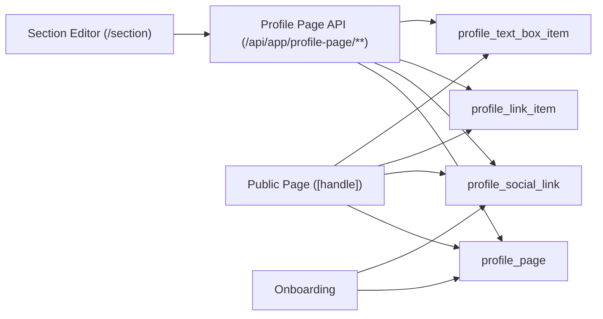

# feat: Add profile page editor

## Overview

Leeve의 공개 프로필 페이지를 온보딩 전용 생성 흐름에서 실제 편집 가능한 페이지 빌더로 확장한다. 이번 작업은 프로필 메타데이터(Profile), 소셜 링크(Social), 링크 아이템(Links), 텍스트 박스(Text Box)를 각각 수정 가능한 엔터티로 정리하고, 인앱의 `section` 영역을 페이지 편집 표면으로 전환하는 데 초점을 둔다.

## Problem Frame

현재 공개 페이지 데이터는 `profile_page` 단일 테이블과 `socialLinks` JSON 컬럼에 묶여 있고, 편집 UI는 `src/app/(in-app)/(sidebar)/section/profile/page.tsx`에서 `app_user`를 직접 수정한다. 이 구조는 아래 요구사항을 제대로 지원하지 못한다.

- 프로필 이미지 제거(`null` 저장), 이름/바이오 변경, 사이트 핸들 수정
- 소셜 링크의 추가/수정/삭제
- 링크 아이템의 추가/수정/삭제와 순서 변경
- 텍스트 박스의 추가/수정/삭제와 순서 변경

핵심 문제는 필드별 편집 가능성(`handle`/`name`은 수정-only, `bio`/`image`는 clear 가능)과 반복 가능한 컬렉션(소셜/링크/텍스트 박스)을 현재 구조가 제대로 표현하지 못한다는 점이다. 따라서 페이지 편집 규칙은 `profile_page` 계열 도메인으로 옮기되, 공개 페이지의 사용자 정보 폴백 여부는 별도 렌더링 결정으로 분리해야 한다.

## Requirements Trace

- R1. 사용자는 공개 페이지의 이름과 사이트 핸들을 수정할 수 있어야 한다.
- R2. 사용자는 공개 페이지의 바이오를 수정하거나 비울 수 있어야 하며, 이미지는 교체하거나 제거하여 `null`로 저장할 수 있어야 한다.
- R3. 사용자는 여러 소셜 링크를 추가, 수정, 삭제할 수 있어야 한다.
- R4. 사용자는 링크 아이템을 추가, 수정, 삭제할 수 있고 각 아이템의 `title`, `description`, `url`을 편집할 수 있어야 한다.
- R5. 사용자는 텍스트 박스를 추가, 수정, 삭제할 수 있고 각 아이템의 `title`, `description`을 편집할 수 있어야 한다.
- R6. 링크 아이템과 텍스트 박스는 각 컬렉션 내부에서 순서를 바꿀 수 있어야 한다.
- R7. 편집 결과는 공개 페이지(`src/app/(website-layout)/[handle]/page.tsx`)와 인앱 미리보기/네비게이션에 즉시 일관되게 반영되어야 한다.

## Scope Boundaries

- 소셜 링크의 순서 변경은 이번 범위에 포함하지 않는다. 표시 순서는 플랫폼 우선순위 또는 생성 순서로 고정한다.
- 링크와 텍스트 박스 사이의 교차 정렬은 지원하지 않는다. 각 타입 내부에서만 순서를 관리한다.
- 핸들 변경 시 이전 핸들에 대한 리다이렉트/별칭 저장은 포함하지 않는다.
- 분석, 조회수, 커스텀 테마, 블록 공개/비공개 토글은 이번 범위에 포함하지 않는다.

## Context & Research

### Relevant Code and Patterns

- `src/db/schema/core/profile-page.ts`: 현재 공개 페이지 메타데이터와 `socialLinks` JSON 구조 정의
- `src/app/api/app/onboarding/route.ts`: 프로필 페이지 생성 시점과 현재 입력 스키마
- `src/app/api/handles/availability/route.ts`: 핸들 유효성/중복 검사 패턴
- `src/app/api/app/me/route.ts`: 인증된 사용자 부트스트랩 응답 형식
- `src/app/(website-layout)/[handle]/page.tsx`: 공개 페이지 렌더링과 현재 `app_user` 폴백 사용 지점
- `src/app/(in-app)/(sidebar)/section/profile/page.tsx`: 기존 프로필 편집 UI와 S3 업로드 연결점
- `src/components/ui/s3-uploader/s3-uploader.tsx`: 이미지 업로드 재사용 컴포넌트
- `src/hooks/use-handle-availability.ts`: React Query 기반 핸들 중복 검사 훅

### Institutional Learnings

- `docs/solutions/` 디렉토리가 없어 재사용 가능한 내부 학습 문서는 확인되지 않았다.

### External References

- 외부 조사 생략. Next.js App Router + Drizzle + React Query 패턴이 코드베이스에 이미 존재하고, 이번 작업의 핵심 불확실성은 라이브러리 사용법이 아니라 현재 도메인 모델 재구성에 있다.

## Key Technical Decisions

- `profile_page`를 공개 페이지 편집의 primary write source로 유지한다.
  `handle`, `name`, `bio`, `image` 저장은 모두 `profile_page`로 통일하되, 공개 페이지 렌더링에서 `app_user` 값을 보조 폴백으로 사용할지는 표현 계층에서 결정한다.

- `socialLinks` JSON 컬럼은 관계형 테이블로 정규화한다.
  소셜 링크는 추가/수정/삭제 단위가 분명하고 플랫폼별 검증이 필요하므로 `jsonb`보다 행 단위 CRUD가 맞다.

- 링크 아이템과 텍스트 박스는 별도 테이블로 분리한다.
  `profile_link_item`은 `url`이 필수이고 `profile_text_box_item`은 `url`이 없어야 하므로, 하나의 generic block 테이블보다 별도 테이블이 검증과 쿼리, 순서 제약을 단순하게 만든다.

- 재정렬 UI는 최신 안정 버전의 `dnd-kit`로 구현한다.
  서버는 여전히 `position` 기반 dense ordering을 유지하고, 클라이언트는 drag-and-drop 상호작용을 `@dnd-kit/core`, `@dnd-kit/sortable`, `@dnd-kit/modifiers` 위에서 구현한다.

- 편집용 API는 `me` 엔드포인트와 분리한다.
  `/api/app/me`는 인증된 사용자 부트스트랩 응답으로 유지하고, 공개 페이지 편집은 `/api/app/profile-page/**` 아래 전용 라우트로 분리한다. 이렇게 해야 account profile과 public page profile의 책임이 섞이지 않는다.

## Open Questions

### Resolved During Planning

- 공개 페이지가 `profile_page` 값이 비어 있을 때 `app_user` 값으로 폴백할 수 있는가?
  가능하다. `name`과 `handle`은 수정-only이고 `image` 제거는 `null` 저장으로 표현하므로, 저장 모델과 렌더링 폴백 정책은 분리한다.

- 링크와 텍스트 박스를 하나의 generic section 테이블로 합쳐야 하는가?
  아니다. 현재 요구사항은 타입별 CRUD와 타입별 순서 변경에 집중되어 있어 별도 테이블이 더 단순하고 구현 위험이 낮다.

- reorder UI는 무엇으로 구현할 것인가?
  npm 최신 안정 태그 기준 `@dnd-kit/core 6.3.1`, `@dnd-kit/sortable 10.0.0`, `@dnd-kit/modifiers 9.0.0`, `@dnd-kit/utilities 3.2.2`를 사용한다.

### Deferred to Implementation

- `/section/profile`를 `/section`으로 리다이렉트할지, 같은 편집 컴포넌트를 재사용하는 thin wrapper로 둘지는 실제 라우팅/디자인 조합을 보며 결정한다.
- 소셜 링크 표시 순서를 “플랫폼 우선순위”로 고정할지 “생성 순”으로 둘지는 UI 디자인에 맞춰 구현 시점에 확정한다. 데이터 모델은 두 선택 모두 수용할 수 있게 둔다.

## High-Level Technical Design

> *This illustrates the intended approach and is directional guidance for review, not implementation specification. The implementing agent should treat it as context, not code to reproduce.*

## Phased Delivery

### Phase 1

- 스키마 정규화
- 프로필 메타데이터/소셜 링크 편집 API
- 공개 페이지의 canonical source 정리

### Phase 2

- 링크 아이템 CRUD + reorder
- 텍스트 박스 CRUD + reorder

### Phase 3

- `/section` 통합 편집 UI
- 온보딩, 사이드바, `me` 응답 정합성 마무리

## Implementation Units

- [ ] **Unit 1: Normalize the profile page persistence model**

**Goal:** 공개 페이지 편집 요구사항을 수용할 수 있도록 스키마를 정규화하고 마이그레이션 전략을 확정한다.

**Requirements:** R1, R2, R3, R4, R5, R6

**Dependencies:** None

**Files:**
- Modify: `src/db/schema/core/profile-page.ts`
- Modify: `src/db/schema/profile-page.ts`
- Create: `drizzle/0002_profile_page_editor.sql`
- Test: `src/lib/profile-page/migration.test.ts`

**Approach:**
- `profile_page`에 `handle`, `name`, `bio`, `image`를 계속 유지하되, 공개 페이지 기준 필드라는 의미를 문서화한다.
- `profile_social_link` 테이블을 추가한다: `id`, `profilePageId`, `platform`, `url`, `createdAt`, `updatedAt`.
- `profile_link_item` 테이블을 추가한다: `id`, `profilePageId`, `title`, `description`, `url`, `position`, `createdAt`, `updatedAt`.
- `profile_text_box_item` 테이블을 추가한다: `id`, `profilePageId`, `title`, `description`, `position`, `createdAt`, `updatedAt`.
- `profilePageId + platform` unique 제약과, 각 컬렉션별 `profilePageId + position` unique 인덱스를 둔다.
- 기존 `profile_page.socialLinks` JSON 데이터는 마이그레이션에서 `profile_social_link`로 옮기고, 읽기 경로 전환이 완료되면 컬럼 제거까지 포함한다.

**Execution note:** 기존 `socialLinks` JSON을 새 테이블로 옮기는 매핑 로직부터 테스트 가능하게 분리해 둔다.

**Patterns to follow:**
- `src/db/schema/core/credits.ts`
- `src/db/schema/core/user.ts`
- `drizzle/0001_profile_page_details.sql`

**Test scenarios:**
- Happy path: 기존 `socialLinks` JSON에 유효한 URL이 있는 페이지를 마이그레이션하면 플랫폼별 `profile_social_link` 레코드가 생성된다.
- Edge case: 빈 JSON 또는 모든 값이 빈 문자열인 페이지는 소셜 링크 레코드를 만들지 않는다.
- Error path: 같은 `profilePageId`에 동일 `platform`을 두 번 넣으려 하면 unique 제약으로 실패한다.
- Integration: 링크/텍스트 박스 삭제 후 남은 아이템이 `position` 기준으로 다시 0..n-1 또는 1..n 형태의 dense ordering을 유지한다.

**Verification:**
- 새 스키마만으로 요구사항의 모든 CRUD 단위가 표현 가능하다.
- 기존 `profile_page.socialLinks` 데이터를 손실 없이 새 구조로 이관할 수 있다.

- [ ] **Unit 2: Build profile metadata and social link domain logic**

**Goal:** 프로필 메타데이터와 소셜 링크를 읽고 쓰는 검증/도메인 로직을 `profile_page` 기준으로 정리한다.

**Requirements:** R1, R2, R6

**Dependencies:** Unit 1

**Files:**
- Create: `src/lib/profile-page/queries.ts`
- Create: `src/lib/profile-page/mutations.ts`
- Create: `src/lib/validations/profile-page.schema.ts`
- Create: `src/app/api/app/profile-page/route.ts`
- Create: `src/app/api/app/profile-page/social-links/route.ts`
- Create: `src/app/api/app/profile-page/social-links/[socialLinkId]/route.ts`
- Create: `src/app/api/app/profile-page/handle-availability/route.ts`
- Test: `src/lib/profile-page/mutations.test.ts`
- Test: `src/lib/validations/profile-page.schema.test.ts`

**Approach:**
- `getOwnedProfilePage(userId)` / `getPublicProfilePage(handle)` / `updateProfileMetadata()` / `upsertSocialLink()` / `deleteSocialLink()` 같은 도메인 함수를 분리한다.
- 핸들 변경 시 현재 소유 페이지의 기존 핸들은 허용하고, 다른 페이지와 reserved handle만 차단하는 auth-aware availability 검사를 추가한다.
- `name`과 `handle`은 필수 수정-only 필드로 유지하고, `bio`와 `image`만 nullable로 허용해 clear 동작을 표현한다.
- 소셜 링크는 플랫폼 enum 또는 문자열 유니온으로 제한하되, URL 검증은 route가 아니라 validation schema에서 일관되게 수행한다.

**Patterns to follow:**
- `src/lib/validations/auth.schema.ts`
- `src/app/api/handles/availability/route.ts`

**Test scenarios:**
- Happy path: 현재 페이지의 `name`, `bio`, `image`, `handle`을 유효한 값으로 수정하면 새 값이 저장된다.
- Happy path: 동일 플랫폼 소셜 링크를 수정하면 새 row를 추가하지 않고 기존 row를 갱신한다.
- Edge case: `bio`와 `image`만 빈 값으로 제출하면 `null`로 저장되고, `name`과 `handle`은 빈 값에서 검증 오류가 난다.
- Edge case: 현재 사용자가 이미 가진 핸들로 PATCH하면 “사용 가능”으로 간주된다.
- Error path: reserved handle 또는 다른 사용자가 쓰는 handle로 변경하려 하면 검증 오류가 난다.
- Error path: 잘못된 URL 형식의 소셜 링크는 저장되지 않는다.
- Integration: 프로필 메타데이터 저장 후 조회 함수가 공개 페이지와 인앱 편집기 모두에서 같은 값을 반환한다.

**Verification:**
- 프로필/소셜 저장 규칙이 route 밖의 순수 도메인 계층에서 테스트 가능하다.
- page-facing 필드가 `app_user`가 아닌 `profile_page` 기준으로 일관되게 처리된다.

- [ ] **Unit 3: Add link item CRUD and reorder APIs**

**Goal:** 링크 아이템 컬렉션을 생성, 수정, 삭제, 재정렬할 수 있는 서버 API와 서비스 계층을 만든다.

**Requirements:** R3, R5, R6

**Dependencies:** Unit 1, Unit 2

**Files:**
- Create: `src/app/api/app/profile-page/links/route.ts`
- Create: `src/app/api/app/profile-page/links/[linkId]/route.ts`
- Create: `src/app/api/app/profile-page/links/reorder/route.ts`
- Modify: `src/lib/profile-page/mutations.ts`
- Modify: `src/lib/validations/profile-page.schema.ts`
- Test: `src/lib/profile-page/link-items.test.ts`

**Approach:**
- create/update/delete와 reorder를 분리된 mutation으로 둔다.
- reorder는 `orderedIds: string[]`를 받아 해당 `profilePageId` 소유 아이템만 재색인하고, 누락/타 사용자 ID가 포함되면 거부한다.
- 링크 설명(`description`)은 optional nullable, `title`과 `url`은 필수로 둔다.
- 삭제 시 뒤에 있는 아이템의 `position`을 다시 채워 dense ordering을 유지한다.

**Patterns to follow:**
- `src/app/api/app/onboarding/route.ts`
- `src/lib/react-query/query-keys.ts`

**Test scenarios:**
- Happy path: 링크를 생성하면 마지막 위치에 추가되고 `title`, `description`, `url`이 저장된다.
- Happy path: reorder API에 `[c, a, b]`를 보내면 이후 조회 순서가 해당 배열과 일치한다.
- Edge case: 설명 없이 링크를 생성해도 저장된다.
- Edge case: 마지막 아이템을 삭제하면 남은 아이템들의 `position`이 끊기지 않는다.
- Error path: 잘못된 URL이나 빈 제목으로 링크를 저장하려 하면 400 계열 오류가 난다.
- Error path: 다른 사용자의 링크 ID를 수정/삭제/재정렬에 포함하면 404 또는 403으로 거부된다.
- Integration: 링크 목록을 연속으로 생성한 뒤 reorder와 delete를 수행해도 공개 페이지 조회 순서가 서버 정렬 결과와 동일하다.

**Verification:**
- 링크 컬렉션은 서버 기준으로 일관된 순서를 유지한다.
- CRUD와 reorder가 서로의 데이터 무결성을 깨지 않는다.

- [ ] **Unit 4: Add text box CRUD and reorder APIs**

**Goal:** 텍스트 박스 컬렉션을 링크와 동일한 규칙으로 관리하되, `url` 없는 콘텐츠 블록으로 분리한다.

**Requirements:** R4, R5, R6

**Dependencies:** Unit 1, Unit 2

**Files:**
- Create: `src/app/api/app/profile-page/text-boxes/route.ts`
- Create: `src/app/api/app/profile-page/text-boxes/[textBoxId]/route.ts`
- Create: `src/app/api/app/profile-page/text-boxes/reorder/route.ts`
- Modify: `src/lib/profile-page/mutations.ts`
- Modify: `src/lib/validations/profile-page.schema.ts`
- Test: `src/lib/profile-page/text-box-items.test.ts`

**Approach:**
- 링크 아이템과 동일한 컬렉션 관리 패턴을 재사용하되, 텍스트 박스는 `title`, `description`만 가진다.
- URL 컬럼을 갖지 않기 때문에 별도 테이블/스키마를 사용해 검증과 API 계약을 명확히 한다.
- reorder contract는 링크와 동일하게 유지해 UI 구현을 단순화한다.

**Patterns to follow:**
- Unit 3에서 확립한 링크 아이템 컬렉션 패턴
- `src/lib/validations/auth.schema.ts`

**Test scenarios:**
- Happy path: 텍스트 박스를 생성하면 마지막 위치에 추가되고 `title`, `description`이 저장된다.
- Happy path: 텍스트 박스 순서를 바꾸면 조회 결과가 새 순서를 따른다.
- Edge case: description 없이 title만 있는 텍스트 박스를 저장할 수 있다.
- Edge case: 하나뿐인 텍스트 박스를 재정렬해도 no-op으로 안전하게 처리된다.
- Error path: 빈 제목으로 생성/수정하려 하면 검증 오류가 난다.
- Error path: 다른 사용자의 텍스트 박스를 수정/삭제하려 하면 거부된다.
- Integration: 텍스트 박스를 여러 개 만든 뒤 삭제와 reorder를 반복해도 `position` 무결성이 유지된다.

**Verification:**
- 텍스트 박스 컬렉션의 API 계약이 링크와 대칭적이어서 프런트엔드가 재사용 가능한 구조를 갖는다.

- [ ] **Unit 5: Replace the placeholder section page with a unified editor**

**Goal:** `/section`을 실제 공개 페이지 편집 화면으로 바꾸고, 프로필/소셜/링크/텍스트 박스를 한 흐름에서 관리할 수 있게 한다.

**Requirements:** R1, R2, R3, R4, R5, R6

**Dependencies:** Unit 2, Unit 3, Unit 4

**Files:**
- Modify: `src/app/(in-app)/(sidebar)/section/page.tsx`
- Modify: `src/app/(in-app)/(sidebar)/section/profile/page.tsx`
- Create: `src/components/section/profile-page-editor.tsx`
- Create: `src/components/section/social-links-editor.tsx`
- Create: `src/components/section/link-items-editor.tsx`
- Create: `src/components/section/text-box-items-editor.tsx`
- Create: `src/app/api/app/profile-page/upload-image/route.ts`
- Modify: `src/lib/react-query/query-keys.ts`
- Test: `src/lib/profile-page/editor-state.test.ts`

**Approach:**
- 현재 placeholder인 `/section/page.tsx`를 메인 편집 화면으로 사용한다.
- 프로필/배경 이미지 업로드는 저장 대상 route를 `/api/app/profile-page/upload-image`로 분리하고, 사용자별 고정 object key(`profile-page/profile`, `profile-page/background`)와 DB finalize 단계로 `profile_page.image` / `profile_page.backgroundImage` 저장을 보장한다.
- 컬렉션 편집은 “추가 버튼 + inline form + 저장/삭제 + dnd-kit drag-and-drop” 구조로 시작한다.
- React Query 캐시는 `me`와 별도 `profile-page` query key를 사용해, 편집기와 사이드바 갱신 범위를 제어한다.
- 현재 `/section/profile`는 새 편집기의 세부 진입점으로 재사용하거나 `/section`으로 정리한다.

**Patterns to follow:**
- `src/app/(in-app)/(sidebar)/section/profile/page.tsx`
- `src/components/ui/s3-uploader/s3-uploader.tsx`

**Test scenarios:**
- Happy path: 사용자가 프로필 이름/바이오/이미지를 수정해 저장하면 새 값이 `profile_page` 컬럼, 폼, 미리보기에 반영된다.
- Happy path: 링크/텍스트 박스를 추가한 뒤 drag-and-drop으로 순서를 바꾸면 화면 순서가 즉시 바뀌고 저장 후에도 유지된다.
- Edge case: 이미지 삭제와 바이오 삭제를 수행하면 대응 필드가 빈 상태 UI로 돌아가고, 이름을 비워 저장하려 하면 검증 오류가 난다.
- Edge case: 현재 핸들을 다시 입력하면 중복 오류 없이 저장 가능 상태를 유지한다.
- Error path: 저장 실패 시 낙관적 UI가 롤백되고 오류 메시지가 보인다.
- Integration: 한 화면에서 프로필과 링크 목록을 연속 저장해도 캐시 충돌 없이 최신 상태가 유지된다.

**Verification:**
- `/section` 하나만으로 요구사항의 모든 편집 작업을 수행할 수 있다.
- 편집기 상태와 서버 상태의 불일치가 저장/실패 경로 모두에서 제어된다.

- [ ] **Unit 6: Align onboarding, public page rendering, and sidebar summary**

**Goal:** 새 스키마와 편집 흐름이 온보딩, 공개 페이지, 사이드바 요약과 충돌하지 않도록 읽기 모델을 정리한다.

**Requirements:** R1, R2, R3, R4, R5, R6

**Dependencies:** Unit 2, Unit 3, Unit 4, Unit 5

**Files:**
- Modify: `src/app/api/app/onboarding/route.ts`
- Modify: `src/lib/validations/auth.schema.ts`
- Modify: `src/app/api/app/me/route.ts`
- Modify: `src/app/api/app/me/types.ts`
- Modify: `src/components/sections/sidebar.tsx`
- Modify: `src/app/(website-layout)/[handle]/page.tsx`
- Modify: `src/components/auth/onboarding-form.tsx`
- Test: `src/lib/profile-page/public-page.test.ts`

**Approach:**
- 온보딩은 `profile_page` 생성 + 초기 소셜 링크 삽입까지만 담당하고, 링크/텍스트 박스는 이후 `/section`에서 관리하도록 둔다.
- 공개 페이지 조회는 `profile_page`와 새 하위 테이블을 함께 읽도록 바꾸고, `app_user.name` / `app_user.image` 폴백은 표현 계층에서 계속 허용한다.
- 공개 페이지는 프로필 섹션, 소셜 섹션, 링크 목록, 텍스트 박스 목록을 빈 상태를 포함해 안정적으로 렌더링한다.
- 사이드바 요약은 페이지 편집 대상과 같은 데이터 소스를 읽도록 맞춰 “삭제했는데 남아 보이는” 문제를 없앤다.

**Patterns to follow:**
- `src/app/(website-layout)/[handle]/page.tsx`
- `src/app/api/app/me/route.ts`
- `src/components/sections/sidebar.tsx`

**Test scenarios:**
- Happy path: 온보딩으로 생성된 페이지는 새 읽기 모델에서도 정상적으로 공개 페이지에 렌더링된다.
- Happy path: 링크와 텍스트 박스를 추가하면 공개 페이지에 같은 순서로 노출된다.
- Edge case: `bio`와 `image`가 비어 있으면 공개 페이지는 `app_user` 폴백을 포함한 fallback label과 빈 상태 섹션을 보여준다.
- Edge case: 링크/텍스트 박스가 하나도 없으면 공개 페이지 레이아웃이 깨지지 않는다.
- Error path: 존재하지 않는 핸들은 기존처럼 `notFound()`를 반환한다.
- Integration: 편집기 저장 직후 `/section`, 사이드바, 공개 페이지가 동일한 데이터를 보여준다.

**Verification:**
- 온보딩 이후 신규 편집 기능이 추가돼도 기존 가입 흐름이 깨지지 않는다.
- 공개 페이지와 인앱 요약이 같은 페이지 데이터를 반영한다.

## System-Wide Impact

- **Interaction graph:** 온보딩(`src/app/api/app/onboarding/route.ts`), 인증 사용자 부트스트랩(`src/app/api/app/me/route.ts`), 인앱 편집기(`/section`), 공개 페이지(`[handle]`)가 모두 `profile_page` 계열 읽기 모델을 공유하게 된다.
- **Error propagation:** 핸들 중복, URL 검증 실패, 소유권 위반, reorder payload 불일치는 API 레벨에서 4xx로 반환하고, 편집기는 필드 오류 또는 toast로 노출해야 한다.
- **State lifecycle risks:** 재정렬/삭제 시 `position` 재색인 누락이 생기면 공개 페이지와 편집기의 순서가 틀어질 수 있다. 컬렉션 mutation은 항상 서버에서 dense ordering을 재보장해야 한다.
- **API surface parity:** 온보딩과 편집기가 동일한 핸들/URL 검증 규칙을 공유해야 하므로 validation schema를 분산 복제하면 안 된다.
- **Integration coverage:** 공개 페이지 렌더링은 단위 테스트만으로 충분하지 않다. “편집 저장 -> `me` 갱신 -> 공개 페이지 반영” 흐름을 확인하는 통합 검증이 필요하다.
- **Unchanged invariants:** 사용자 인증과 결제 영역은 이번 작업 범위에서 변경하지 않는다. `app_user`는 계정 식별자와 인증 컨텍스트를 위한 테이블로 유지된다.

## Risks & Dependencies

| Risk | Mitigation |
|------|------------|
| 기존 `socialLinks` JSON 데이터 유실 가능성 | 마이그레이션 매핑 테스트를 추가하고, 컬럼 제거 전 새 읽기 경로를 먼저 전환한다. |
| 공개 페이지의 `app_user` 폴백과 `profile_page` 저장 상태가 어긋날 위험 | 렌더링 계층에서 어떤 필드가 폴백 가능한지(`name`, `image`)를 명시적으로 구분하고, 저장은 항상 `profile_page`로 통일한다. |
| reorder/delete 이후 `position` 중복 또는 공백 발생 | reorder와 delete mutation에 서버 측 재색인 로직을 공통화한다. |
| 편집기 범위가 커져 `/section` UX가 산만해질 위험 | 프로필/소셜/링크/텍스트 박스를 카드 또는 아코디언으로 구획하고 저장 단위를 분리한다. |
| 업로드된 이전 이미지 파일이 S3에 남는 문제 | 프로필/배경 이미지는 사용자별 고정 object key 2개만 사용하고, 같은 파일은 hash 비교로 업로드를 건너뛰어 신규 orphan 생성을 막는다. |

## Documentation / Operational Notes

- `docs/plans/` 외 별도 운영 문서 업데이트는 필수는 아니지만, 공개 페이지 편집 책임은 `profile_page`에 두고 렌더링 폴백만 `app_user`를 사용할 수 있다는 점은 구현 PR 설명에 명시하는 편이 좋다.
- QA 체크리스트에는 “프로필 필드 삭제 후 공개 페이지 반영”, “링크/텍스트 박스 reorder 후 새로고침 유지”, “핸들 변경 후 새 URL 접근”이 포함돼야 한다.
- 이미지 업로드 관련 회귀 방지 지식은 `docs/solutions/logic-errors/profile-page-image-url-persistence-regression-2026-04-25.md`에 기록되어 있다.

## Priority Order

1. Unit 1: 스키마와 마이그레이션 기반 정리
2. Unit 2: 프로필 메타데이터/소셜 링크 도메인 및 API
3. Unit 3: 링크 아이템 CRUD + reorder
4. Unit 4: 텍스트 박스 CRUD + reorder
5. Unit 5: `/section` 통합 편집 UI 마감
6. Unit 6: 공개 페이지, 온보딩, 사이드바 정합성 마무리

이 순서를 권장하는 이유는, 먼저 스키마와 도메인 규칙을 고정한 뒤 컬렉션 CRUD를 완성해야 편집 UI가 얇게 유지되기 때문이다. Unit 6에서는 저장 모델과 렌더링 폴백을 분리해 public view와 editor view가 같은 페이지 데이터를 공유하도록 마무리한다.

## Sources & References

- Related code: `src/db/schema/core/profile-page.ts`
- Related code: `src/app/api/app/onboarding/route.ts`
- Related code: `src/app/api/app/me/route.ts`
- Related code: `src/app/(website-layout)/[handle]/page.tsx`
- Related code: `src/app/(in-app)/(sidebar)/section/profile/page.tsx`
