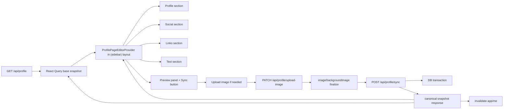

# feat: Add local draft sync to profile page editor

## Overview

`section` 편집기를 "입력할 때마다 DB 반영" 방식에서 "서버 스냅샷을 가져온 뒤 로컬 draft를 편집하고, preview 패널의 `Sync` 버튼으로 한 번에 반영"하는 방식으로 전환한다. 핵심은 React Query를 서버 원본 캐시로 유지하고, `(sidebar)` 레이아웃 범위에서만 살아있는 editor store를 도입해 profile/social/links/text와 preview가 같은 draft를 공유하도록 만드는 것이다.

## Problem Frame

현재 편집 흐름은 `src/components/section/profile-page/use-profile-page-editor.ts`가 각 액션마다 개별 API를 호출하고 React Query 캐시를 즉시 갱신한다. 이 구조는 아래 요구사항과 맞지 않는다.

- 아이템 추가, 수정, 삭제, 순서 변경이 모두 로컬 state에만 반영되어야 한다.
- 사용자가 `Sync`를 누르기 전에는 DB가 바뀌면 안 된다.
- preview 영역은 현재 로컬 draft를 그대로 보여야 한다.
- `Sync` 버튼은 변경된 로컬 값이 없으면 비활성화되어야 한다.
- profile/social/link/text 편집 화면이 서로 다른 라우트여도 같은 draft를 공유해야 한다.

즉, 현재의 "field-level mutation + optimistic cache" 모델은 요구사항과 충돌한다. 이번 작업은 서버에서 읽은 스냅샷과 사용자가 편집 중인 draft를 분리하고, 저장 시점에만 두 상태를 다시 합치는 아키텍처로 재정의하는 데 목적이 있다.

## Requirements Trace

- R1. 초기 상태는 서버에서 가져와야 한다.
- R2. profile/social/link/text의 모든 편집은 `Sync` 전까지 로컬 state에만 반영되어야 한다.
- R3. `Sync`는 현재 draft 전체를 한 번에 DB에 반영해야 한다.
- R4. `(sidebar)` 레이아웃의 preview 영역에 새 컴포넌트를 두고, 이 컴포넌트가 현재 로컬 draft와 `Sync` 버튼을 함께 보여야 한다.
- R5. 로컬에서 변경된 값이 없으면 `Sync` 버튼은 비활성화되어야 한다.
- R6. `/section/profile`, `/section/social`, `/section/link`, `/section/text-box`는 같은 전역 draft를 공유해야 한다.
- R7. Sync 성공 후에는 editor store, React Query 서버 스냅샷, `useUser()` 기반 sidebar 정보가 다시 일치해야 한다.
- R8. 핸들 availability 같은 읽기 전용 서버 검증은 계속 사용할 수 있어야 하지만, 이것이 draft 저장을 대체해서는 안 된다.

## Scope Boundaries

- 자동 저장, debounce 저장, 페이지 이탈 시 자동 커밋은 포함하지 않는다.
- 다중 탭 동시 편집 충돌 해결은 포함하지 않는다. 이번 변경은 단일 세션 draft 편집에 집중한다.
- 실시간 협업, undo/redo 히스토리, draft 영속화(localStorage/IndexedDB)는 포함하지 않는다.
- public profile 페이지는 Sync 전 draft를 직접 읽지 않는다. Sync 전 draft 노출은 `(sidebar)` preview에 한정한다.

## Context & Research

### Relevant Code and Patterns

- `src/components/section/profile-page/use-profile-page-editor.ts`: 현재 즉시 저장 + 낙관적 캐시 갱신 훅
- `src/app/(in-app)/(sidebar)/layout.tsx`: preview 영역이 아직 placeholder인 레이아웃
- `src/components/section/profile-page/profile-section-editor.tsx`
- `src/components/section/profile-page/social-links-section-editor.tsx`
- `src/components/section/profile-page/links-section-editor.tsx`
- `src/components/section/profile-page/text-boxes-section-editor.tsx`
- `src/app/api/profile/route.ts`: 현재 editor GET + profile metadata PATCH 진입점
- `src/lib/profile-page/queries.ts`: profile page editor/public page read 모델
- `src/lib/profile-page/mutations.ts`: item별 즉시 저장 mutation
- `src/hooks/use-profile-image-upload.ts`: 로컬 object URL preview와 실제 업로드 분리 패턴
- `src/components/ui/file-upload.tsx`: `useSyncExternalStore` 기반 selector store 패턴
- `src/components/sections/sidebar.tsx`: `useUser()` 기반 persisted profile 표시 지점
- `src/app/(public-profile)/[handle]/page.tsx`: public profile 렌더링 지점

### Institutional Learnings

- `docs/solutions/` 디렉토리가 없어 재사용 가능한 내부 학습 문서는 확인되지 않았다.

### External References

- 외부 조사 생략. 필요한 패턴은 이미 코드베이스 안에 있다.

## Key Technical Decisions

- React Query는 계속 서버 스냅샷 캐시로만 사용한다.
  `queryKeys.app.profilePage()`는 초기 로드와 Sync 성공 후 rebase 용도로만 쓰고, 편집 중 draft state를 React Query 캐시에 직접 덮어쓰지 않는다.

- 전역 draft는 `(sidebar)` 레이아웃 범위의 외부 store로 관리한다.
  plain context + `useState`는 모든 consumer를 넓게 리렌더링시키기 쉽다. 이미 `src/components/ui/file-upload.tsx`에 있는 `useSyncExternalStore` 패턴을 따라 selector 기반 store를 두는 편이 현재 요구사항과 성능 요구에 맞다.

- draft는 "서버 base snapshot + 현재 draft + ephemeral UI state"로 나눈다.
  base snapshot은 dirty 판정과 Sync 성공 후 rebase 기준으로 유지하고, draft는 실제 폼 값/정렬/추가/삭제 상태를 가진다. 이미지 파일 선택처럼 서버 직렬화가 불가능한 값은 별도 ephemeral 필드로 둔다.

- dirty 여부는 store 내부에서 섹션 단위로 추적한다.
  렌더링마다 전체 문서를 deep-compare하지 않고, 액션 시점에 `profile`, `socialLinks`, `linkItems`, `textBoxItems`, `image` 단위 dirty 플래그를 갱신해 `hasUnsyncedChanges`를 만든다.

- Sync는 full-document 단일 엔드포인트로 처리한다.
  item별 route를 여러 번 호출하는 대신, draft 전체를 한 번에 검증하고 transaction으로 반영하는 `POST /api/profile/sync` 경로를 도입한다. 이렇게 해야 추가/삭제/정렬/프로필 수정이 한 commit으로 보장된다.

- 새 아이템은 client temp id를 쓴다.
  Sync 전에도 생성 직후 편집/정렬/삭제가 가능해야 하므로, link/text/social draft 엔트리는 `draft:` prefix 같은 임시 id를 허용하고 Sync 응답에서 실제 DB id로 교체한다.

- preview는 public page와 최대한 같은 표시 컴포넌트를 재사용한다.
  `src/app/(public-profile)/[handle]/page.tsx`의 presentational markup을 컴포넌트로 추출해 public page와 editor preview가 같은 렌더링 규칙을 따르도록 맞춘다.

- 이미지 선택은 로컬 draft로 유지하되, 업로드 성공 후에는 이미지 컬럼을 즉시 finalize한다.
  선택 직후에는 object URL만 preview에 반영한다. 사용자가 `Sync`를 누르면 필요한 이미지를 사용자별 고정 object key(`profile-page/profile`, `profile-page/background`)로 업로드하고, 업로드 성공 직후 `PATCH /api/profile/upload-image`가 `profile_page.image` 또는 `profile_page.backgroundImage`를 저장한다. 이후 full draft sync는 같은 URL을 포함해 전체 편집 상태를 다시 정합화한다.

## Open Questions

### Resolved During Planning

- 전역 상태는 Context, React Query, 별도 store 중 무엇이 적절한가?
  `(sidebar)` 레이아웃 범위의 selector 기반 외부 store가 가장 적절하다. 전역 공유는 되면서도 리렌더 범위를 최소화할 수 있다.

- Sync는 기존 item별 API를 여러 번 호출해야 하는가?
  아니다. draft 전체를 받는 단일 sync endpoint가 맞다. 원자성, 오류 처리, dirty reset이 훨씬 단순해진다.

- preview는 어디에 붙여야 하는가?
  `src/app/(in-app)/(sidebar)/layout.tsx`의 오른쪽 preview 영역에 전용 컴포넌트를 추가한다. 이 컴포넌트가 draft 구독과 `Sync` 버튼을 담당한다.

- 핸들 availability 검사는 유지해야 하는가?
  유지한다. 단, 읽기 전용 보조 검증이며 저장은 오직 `Sync`만 수행한다.

### Deferred to Implementation

- Sync payload에 충돌 감지용 revision token을 포함할지, 단순 last-write-wins로 갈지는 구현 시점에 최종 결정한다.
- 기존 granular write route를 즉시 삭제할지, 새 flow가 안정화된 뒤 제거할지는 구현 순서를 보며 확정한다.

## High-Level Technical Design

> *This illustrates the intended approach and is directional guidance for review, not implementation specification. The implementing agent should treat it as context, not code to reproduce.*

## Implementation Units

- [x] **Unit 1: Define the full-draft sync contract and server apply pipeline**

**Goal:** Sync 버튼이 profile/social/link/text 전체 draft를 한 번에 검증하고 DB에 반영할 수 있는 서버 계약을 만든다.

**Requirements:** R1, R2, R3, R7, R8

**Dependencies:** None

**Files:**
- Modify: `src/lib/profile-page/types.ts`
- Modify: `src/lib/validations/profile-page.schema.ts`
- Modify: `src/lib/profile-page/mutations.ts`
- Modify: `src/app/api/profile/route.ts`
- Create: `src/app/api/profile/sync/route.ts`
- Test: `src/lib/profile-page/profile-page-sync.test.ts`

**Approach:**
- editor read 모델과 sync payload 모델을 분리하지 말고, 가능한 한 같은 문서 형태(`page`, `socialLinks`, `linkItems`, `textBoxItems`)를 공유한다.
- sync route는 현재 서버 snapshot 전체를 반환하고, POST는 full draft payload를 받아 transaction으로 반영한다.
- metadata 수정, social upsert/delete/reorder, link upsert/delete/reorder, text upsert/delete/reorder를 한 transaction에서 처리한다.
- 기존 DB row는 id로 매칭하고, `draft:` 같은 temp id는 신규 row로 생성한다.
- 클라이언트 배열 순서를 canonical ordering으로 간주하고 서버는 `position`을 dense ordering으로 재계산한다.
- 이미지 교체는 sync 직전 업로드하되, 업로드 성공 직후 전용 finalize route가 `profile_page.image` / `profile_page.backgroundImage`를 먼저 저장한다. sync route는 같은 URL을 포함한 full draft를 transaction으로 반영해 최종 canonical snapshot을 반환한다.

**Patterns to follow:**
- `src/app/api/profile/route.ts`
- `src/lib/profile-page/mutations.ts`
- `src/hooks/use-profile-image-upload.ts`

**Test scenarios:**
- Happy path: profile 필드 수정 + link 추가 + text reorder를 포함한 full draft를 Sync하면 모든 변경이 한 요청으로 반영된다.
- Happy path: temp id를 가진 새 link/text item을 Sync하면 실제 DB id를 가진 canonical snapshot이 응답된다.
- Edge case: 기존 item을 draft 배열에서 제거한 뒤 Sync하면 해당 row가 삭제되고 남은 아이템의 `position`이 촘촘하게 재정렬된다.
- Edge case: 변경 없는 snapshot을 Sync하면 결과가 동일하고 dirty reset용 canonical payload가 반환된다.
- Error path: handle 중복, invalid URL, 잘못된 temp id payload는 4xx로 거부되고 기존 DB 상태는 보존된다.
- Error path: sync 중간에 일부 write가 실패하면 transaction rollback으로 partial write가 남지 않는다.
- Integration: image replace 또는 remove를 포함한 Sync가 성공하면 `page.image` / `page.backgroundImage`, fixed storage object key, preview canonical URL이 일치한다.

**Verification:**
- profile page 편집의 모든 서버 write가 단일 sync 진입점으로 수렴한다.
- 응답 payload만으로 클라이언트 store와 React Query snapshot을 동일 상태로 재설정할 수 있다.

- [x] **Unit 2: Add a layout-scoped editor store with selector subscriptions**

**Goal:** `(sidebar)` 라우트 하위 어디에서든 같은 draft를 읽고 수정할 수 있는 고성능 store를 만든다.

**Requirements:** R1, R2, R5, R6, R7

**Dependencies:** Unit 1

**Files:**
- Create: `src/components/section/profile-page/profile-page-editor-store.ts`
- Create: `src/components/section/profile-page/profile-page-editor-provider.tsx`
- Modify: `src/app/(in-app)/(sidebar)/layout.tsx`
- Modify: `src/components/section/profile-page/use-profile-page-editor.ts`
- Test: `src/components/section/profile-page/profile-page-editor-store.test.ts`

**Approach:**
- provider는 `src/app/(in-app)/(sidebar)/layout.tsx`에서 한 번만 마운트되고, 내부에서 `profilePageQueryOptions()`를 사용해 서버 snapshot을 읽는다.
- store state는 최소한 `base`, `draft`, `dirty`, `hasUnsyncedChanges`, `syncStatus`, `syncError`, `pendingImageFile`, `previewImageUrl`를 가진다.
- `useStore(selector)` 패턴으로 컴포넌트가 필요한 slice만 구독하도록 만든다.
- 액션은 `updateProfileField`, `setSocialUrl`, `addLink`, `updateLink`, `removeLink`, `reorderLinks`, `addTextBox`, `updateTextBox`, `removeTextBox`, `reorderTextBoxes`, `selectImage`, `clearImage`, `rebaseFromServer` 수준으로 나눈다.
- navigation 중에도 draft를 유지해야 하므로 기존 개별 page hook 내부의 local `useState`는 provider store로 이동한다.
- `hasUnsyncedChanges`는 액션 시점에 섹션 단위 dirty를 갱신해 계산한다.

**Execution note:** selector 경계가 핵심이므로 store 설계부터 고정한 뒤 section component를 얹는 순서가 안전하다.

**Patterns to follow:**
- `src/components/ui/file-upload.tsx`
- `src/lib/get-strict-context.tsx`
- `src/app/Providers.tsx`

**Test scenarios:**
- Happy path: query에서 받은 snapshot으로 store를 초기화하면 각 section selector가 올바른 초기값을 읽는다.
- Happy path: `/section/profile`에서 name을 수정한 뒤 `/section/link`로 이동해도 draft가 유지된다.
- Edge case: 값을 원래 값으로 되돌리면 해당 섹션 dirty가 해제되고 전체 `hasUnsyncedChanges`도 적절히 갱신된다.
- Edge case: 이미지 파일만 선택한 상태에서도 `hasUnsyncedChanges`가 true가 된다.
- Integration: link item 변경이 profile selector 구독 값에는 영향을 주지 않아 불필요한 리렌더 범위가 제한된다.

**Verification:**
- section 라우트 간 이동으로 draft가 유실되지 않는다.
- `Sync` 버튼은 store의 `hasUnsyncedChanges`만 구독해 활성/비활성을 안정적으로 결정한다.

- [x] **Unit 3: Refactor section editors to local-only draft mutations**

**Goal:** 각 편집 화면이 더 이상 item별 write API를 호출하지 않고, 오직 editor store만 갱신하도록 바꾼다.

**Requirements:** R2, R5, R6, R8

**Dependencies:** Unit 2

**Files:**
- Modify: `src/components/section/profile-page/profile-section-editor.tsx`
- Modify: `src/components/section/profile-page/social-links-section-editor.tsx`
- Modify: `src/components/section/profile-page/links-section-editor.tsx`
- Modify: `src/components/section/profile-page/text-boxes-section-editor.tsx`
- Modify: `src/components/section/profile-page/use-profile-page-editor.ts`
- Modify: `src/hooks/use-profile-page-handle-availability.ts`
- Test: `src/components/section/profile-page/profile-page-section-editors.test.tsx`

**Approach:**
- profile 화면의 `Save profile` 버튼, social의 개별 저장 버튼, link/text의 즉시 저장 흐름은 제거하거나 로컬 action으로 대체한다.
- add/update/delete/reorder는 전부 store action만 호출하게 바꾼다.
- 새 link/text item은 즉시 draft 배열에 temp id로 들어가고, 사용자는 Sync 전에도 수정/정렬/삭제할 수 있어야 한다.
- 링크 OG crawl은 계속 허용하되, 결과는 draft 폼 값만 채우고 DB write는 하지 않는다.
- 핸들 availability 훅은 현재 draft handle을 기준으로 계속 debounced read를 수행한다.
- `useProfileImageUpload`는 "선택 즉시 object URL 생성, 업로드는 Sync 시점"에 맞게 store 중심으로 재배치한다. 단, 업로드가 실제로 발생한 뒤에는 DB 컬럼 누락을 막기 위해 finalize PATCH를 즉시 수행한다.

**Patterns to follow:**
- `src/components/section/profile-page/section-layout.tsx`
- `src/hooks/use-profile-image-upload.ts`

**Test scenarios:**
- Happy path: profile/social/link/text 입력을 바꿔도 write API 호출 없이 store draft만 갱신된다.
- Happy path: 새 link를 추가한 직후 제목/설명을 수정하고 순서를 변경해도 모두 로컬 draft에 남는다.
- Edge case: 기존 social link 값을 비우면 draft에서는 제거 상태가 되지만 Sync 전까지 DB에는 반영되지 않는다.
- Edge case: temp id item을 추가 후 바로 삭제하면 Sync payload에서 해당 항목이 제외된다.
- Error path: invalid handle 또는 invalid URL은 로컬 검증/availability 상태로 드러나고 Sync 시 4xx로 재검증된다.
- Integration: 모든 section editor가 같은 provider를 공유해 다른 라우트에서 만든 draft 변경을 즉시 읽는다.

**Verification:**
- editor interaction만으로는 DB write request가 발생하지 않는다.
- 기존 개별 저장 UX 대신 하나의 draft 편집 UX로 일관되게 동작한다.

- [x] **Unit 4: Add the preview panel and Sync workflow in the sidebar layout**

**Goal:** `(sidebar)` 레이아웃의 preview 영역에서 현재 draft를 렌더링하고, dirty 상태에 따라 `Sync` 버튼을 제어한다.

**Requirements:** R3, R4, R5, R6, R7

**Dependencies:** Unit 1, Unit 2, Unit 3

**Files:**
- Modify: `src/app/(in-app)/(sidebar)/layout.tsx`
- Create: `src/components/section/profile-page/profile-page-preview.tsx`
- Create: `src/components/section/profile-page/profile-page-renderer.tsx`
- Modify: `src/app/(public-profile)/[handle]/page.tsx`
- Modify: `src/components/sections/sidebar.tsx`
- Test: `src/components/section/profile-page/profile-page-preview.test.tsx`

**Approach:**
- 현재 placeholder인 preview 영역을 `ProfilePagePreview` 컴포넌트로 교체한다.
- preview는 store의 draft와 `previewImageUrl`을 읽어 public page에 가까운 표시를 즉시 반영한다.
- public profile route는 presentational 부분을 `profile-page-renderer.tsx` 같은 공유 컴포넌트로 추출해 preview와 중복을 줄인다.
- `Sync` 버튼은 `hasUnsyncedChanges === false` 또는 `syncStatus === "syncing"`일 때 disabled 처리한다.
- Sync 클릭 시 필요한 경우 이미지 업로드를 먼저 수행하고, 업로드 결과를 `PATCH /api/profile/upload-image`로 finalize한 뒤 그 URL을 포함한 full draft를 sync route에 보낸다.
- 성공 시 canonical snapshot으로 store를 rebase하고 `queryKeys.app.profilePage()`를 갱신하며 `queryKeys.app.me()`를 invalidate한다.
- 같은 `(sidebar)` 레이아웃 안에서 쓰는 `components/sections/sidebar.tsx`는 provider가 있으면 draft name/handle/image를 우선 사용해 내부 UI 정합성을 맞춘다.

**Patterns to follow:**
- `src/app/(in-app)/(sidebar)/layout.tsx`
- `src/app/(public-profile)/[handle]/page.tsx`
- `src/components/sections/sidebar.tsx`

**Test scenarios:**
- Happy path: draft가 바뀌면 preview가 즉시 갱신되고 `Sync` 버튼이 활성화된다.
- Happy path: 변경 없이 진입했을 때 `Sync` 버튼은 비활성화 상태다.
- Edge case: Sync 성공 후 `Sync` 버튼이 다시 비활성화되고 preview/base snapshot이 동일해진다.
- Edge case: 이미지 교체 draft가 있을 때 preview는 object URL을 보여주고, Sync 중 업로드/finalize 후 canonical `?v={hash}` URL로 재기준화된다.
- Error path: Sync 실패 시 draft는 유지되고 버튼은 다시 활성화되며 오류 메시지가 표시된다.
- Integration: sidebar summary, section editor, preview가 모두 같은 draft 값을 바라본다.

**Verification:**
- 사용자는 preview 패널에서 현재 draft와 Sync 가능 여부를 즉시 확인할 수 있다.
- Sync 성공 이후 persisted data와 editor UI가 다시 한 상태로 정렬된다.

## System-Wide Impact

- **Interaction graph:** `(sidebar)` layout provider가 section editors, preview panel, sidebar summary를 묶고, 이 provider만 sync route와 React Query를 연결한다.
- **Error propagation:** Sync 실패는 preview 패널 또는 공통 toast로 surfaced되며, draft는 유지된다. 로컬 편집 오류가 서버 write 실패로 곧바로 전파되지 않는다.
- **State lifecycle risks:** base와 draft를 섞어 쓰면 dirty 판정이 무너질 수 있으므로, store 내부에서 두 상태를 명확히 분리해야 한다.
- **API surface parity:** write API는 full sync로 수렴하지만, GET `/api/profile`와 handle availability는 계속 유지된다.
- **Integration coverage:** route 이동 후 draft 유지, preview/summary 정합성, Sync 후 React Query rebase와 `useUser()` invalidation은 단위 테스트만으로 부족할 수 있어 통합 시나리오가 필요하다.
- **Unchanged invariants:** public page는 Sync 전 draft를 읽지 않는다. persisted profile data의 외부 노출 시점은 여전히 서버 write 이후다.

## Risks & Dependencies

| Risk | Mitigation |
|------|------------|
| draft와 base를 같은 객체로 다뤄 dirty 판정이 깨질 수 있음 | store에서 base/draft를 분리하고 rebase 전용 action을 둔다 |
| temp id와 서버 id 전환이 꼬이면 reorder나 update가 깨질 수 있음 | Sync 응답은 항상 canonical snapshot 전체를 반환하고, 성공 후 store를 부분 패치하지 않고 전체 rebase한다 |
| 이미지 업로드만 성공하고 DB Sync가 실패하면 storage와 DB가 어긋날 수 있음 | 업로드 object key를 사용자별 `profile`/`background`로 고정하고, 업로드 성공 직후 finalize PATCH로 이미지 컬럼을 저장한다. 같은 파일은 SHA-256 hash 비교로 업로드 자체를 건너뛴다 |
| Context 기반 전역 state로 넓은 리렌더가 발생할 수 있음 | `useSyncExternalStore` + selector 기반 외부 store를 사용한다 |

## Documentation / Operational Notes

- 이 계획은 `docs/plans/2026-04-21-001-feat-profile-page-editor-plan.md`의 "즉시 저장" 전제를 대체한다.
- 구현 후에는 profile page editor 저장 모델이 "manual sync"라는 점이 코드와 테스트 이름에 드러나도록 정리하는 편이 좋다.
- 이미지 업로드/DB finalize 회귀 방지 지식은 `docs/solutions/logic-errors/profile-page-image-url-persistence-regression-2026-04-25.md`에 기록되어 있다.

## Sources & References

- Related plan: `docs/plans/2026-04-21-001-feat-profile-page-editor-plan.md`
- Related code: `src/components/section/profile-page/use-profile-page-editor.ts`
- Related code: `src/app/(in-app)/(sidebar)/layout.tsx`
- Related code: `src/components/ui/file-upload.tsx`
- Related code: `src/app/(public-profile)/[handle]/page.tsx`
