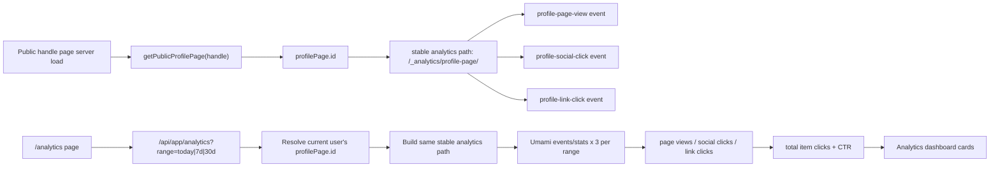

# feat: Add Umami-backed profile analytics dashboard

## Overview

공개 핸들 페이지에서 발생하는 조회와 클릭 이벤트를 Umami로 수집하고, `/analytics` 화면에서 `Today`, `7d`, `30d` 기준으로 요약 지표를 보여준다. 핵심은 `handle`이 아니라 `profile_page.id`를 기준으로 수집 키를 고정해, 핸들이 바뀌어도 동일한 페이지의 누적 지표가 이어지도록 만드는 것이다.

## Problem Frame

현재 코드베이스에는 Umami 스크립트 삽입만 있고(`src/components/analytics/analytics-script.tsx`), 공개 핸들 페이지(`src/app/(public-profile)/[handle]/page.tsx`)와 분석 화면(`src/app/(in-app)/(sidebar)/analytics/page.tsx`) 사이를 연결하는 수집/조회 계층이 없다. 또한 Umami의 기본 pageview는 현재 URL path를 기준으로 집계되므로, `handle` 변경이 생기면 같은 페이지라도 지표가 쪼개진다.

이번 작업은 다음 문제를 함께 해결해야 한다.

- 공개 프로필 페이지의 "페이지 뷰"를 가변 `handle`이 아니라 고정 `profile_page.id` 기준으로 집계해야 한다.
- 페이지 안의 outbound item 클릭을 사회관계망 링크와 일반 링크로 나눠 집계해야 한다.
- `CTR`은 전체 item 클릭 수를 페이지 뷰로 나눈 비율로 계산해야 한다.
- 앱 내부 `/analytics` 페이지는 현재 로그인한 사용자의 페이지 id만 조회해야 하며, Umami API 자격 증명은 서버에만 남아 있어야 한다.

## Requirements Trace

- R1. 공개 핸들 페이지의 조회 수는 `profile_page.id` 기준으로 수집되어야 한다.
- R2. 공개 핸들 페이지 내 아이템 클릭 수를 수집해야 한다.
- R3. 아이템 클릭 수는 `소셜 링크 클릭 수`, `링크 아이템 클릭 수`, `전체 페이지 내 아이템 클릭 수`로 구분 가능해야 한다.
- R4. `CTR(%) = 전체 페이지 내 아이템 클릭 수 / 페이지 뷰 * 100` 으로 계산되어야 한다.
- R5. `/analytics` 화면은 `Today`, `7d`, `30d` 세 구간을 지원해야 한다.
- R6. `Today`는 조회 시점 사용자의 현재 타임존 기준 당일 00:00부터 현재까지, `7d`/`30d`는 현재 시점까지의 최근 7일/30일 롤링 구간으로 계산해야 한다.
- R7. 핸들이 바뀌어도 같은 `profile_page.id`의 지표는 계속 이어져야 한다.
- R8. Umami 조회는 서버에서 수행하고 API 키 또는 토큰은 클라이언트로 노출되면 안 된다.
- R9. 분석 화면은 Umami 설정이 없거나 아직 데이터가 없는 경우에도 오류 대신 빈 상태를 보여줘야 한다.

## Scope Boundaries

- Umami 대시보드 자체의 커스텀 board 구성은 포함하지 않는다.
- 페이지별 일별 시계열 차트, top link 순위, referrer breakdown 같은 확장 리포트는 이번 범위에 포함하지 않는다.
- 과거 `handle` path로 이미 쌓인 기존 pageview 데이터를 `profile_page.id` 기준으로 backfill 하지는 않는다.
- 소셜 링크/일반 링크 외의 텍스트 박스 노출이나 스크롤 깊이 같은 추가 engagement 이벤트는 포함하지 않는다.
- 팀/조직 단위 통합 분석은 포함하지 않고, 현재 로그인한 사용자의 단일 프로필 페이지만 다룬다.

## Context & Research

### Relevant Code and Patterns

- `src/components/analytics/analytics-script.tsx`: 현재 Betterlytics / Umami 스크립트 삽입 진입점
- `src/app/layout.tsx`: 전역 analytics script가 삽입되는 루트 레이아웃
- `src/app/(public-profile)/[handle]/page.tsx`: 공개 핸들 페이지 서버 진입점. 이미 `getPublicProfilePage(handle)`로 `profile_page.id`를 읽고 있다.
- `src/components/section/profile-page/public-profile-page.tsx`: 소셜 링크와 링크 아이템 anchor가 실제 렌더링되는 컴포넌트
- `src/lib/profile-page/queries.ts`: public page 조회 시 `owner.id`, `socialLinks`, `linkItems`를 함께 가져온다.
- `src/app/api/app/me/route.ts` / `src/app/api/app/me/types.ts`: 앱 내부에서 현재 사용자의 `profilePage.id`를 가져올 수 있는 기존 계약
- `src/lib/users/queries.ts`: React Query 기반 `meQueryOptions()` 패턴
- `src/lib/react-query/query-keys.ts`: 앱 내부 query key 등록 위치
- `src/app/(in-app)/(sidebar)/analytics/page.tsx`: 현재 placeholder 상태의 분석 화면

### Institutional Learnings

- `docs/brainstorms/`, `docs/solutions/` 디렉토리는 현재 저장소에 없다. 재사용 가능한 내부 요구사항 문서나 해결 문서는 확인되지 않았다.

### External References

- Umami Tracker configuration: `data-before-send`로 payload 수정 가능, `data-auto-track`은 전역 자동 추적 제어용  
  [Tracker configuration](https://docs.umami.is/docs/tracker-configuration)
- Umami Tracker functions: `umami.track(payload)`와 `umami.track(eventName, data)`로 페이지뷰/이벤트 수동 전송 가능  
  [Tracker functions](https://docs.umami.is/docs/tracker-functions)
- Umami Event data: custom property를 이벤트에 첨부 가능  
  [Event data](https://docs.umami.is/docs/event-data)
- Umami outbound link tracking: 외부 링크 클릭은 명시적인 이벤트 수집이 필요함  
  [Track outbound links](https://docs.umami.is/docs/track-outbound-links)
- Umami Website statistics API: `filters.path` 기반 stats/pageviews 조회 가능  
  [Website statistics](https://docs.umami.is/docs/api/website-stats)
- Umami Events API: `GET /api/websites/:websiteId/events/stats`는 `filters.event`와 `filters.path`를 지원함  
  [Events API](https://docs.umami.is/docs/api/events)
- Umami Cloud API key: Cloud 환경에서는 `x-umami-api-key` 헤더 사용  
  [API Key](https://docs.umami.is/docs/cloud/api-key)
- Umami reporting guide: API 기반 서버 리포팅 패턴  
  [Automate reporting with the API](https://docs.umami.is/docs/guides/automate-reporting-with-api)

### Additional Research Notes

- `Computer Use` 플러그인으로 Dia 앱 탭을 읽으려 했으나, 현재 세션에서는 `approval denied via MCP elicitation` 응답으로 앱 상태 접근이 차단되었다. 따라서 Dia 탭에서의 추가 문맥은 이번 계획에 반영하지 못했다.

## Key Technical Decisions

- 공개 핸들 페이지 분석은 Umami 기본 pageview를 재사용하지 않고, 공개 페이지 전용 커스텀 이벤트 집합으로 구성한다.
  Umami의 built-in pageview는 실제 URL path를 집계하므로 `handle` 변경 시 단절된다. 이번 기능에서는 `profile_page.id`로부터 만든 안정 path(예: `/_analytics/profile-page/<id>`)를 payload의 `url`로 보내고, 페이지 뷰 자체도 `profile-page-view` 커스텀 이벤트로 정의한다. 이 방식이면 전역 tracker 설정을 건드리지 않고도 path filter와 event filter만으로 모든 지표를 복원할 수 있다.

- 클릭 이벤트는 총 2종으로만 보낸다: `profile-social-click`, `profile-link-click`.
  Umami `events/stats`는 `filters.event`를 지원하므로, 전체 클릭 수는 두 이벤트 합으로 계산하면 된다. 별도의 `profile-item-click` 이벤트를 중복 전송하지 않아도 요구 지표를 충족한다.

- `CTR` 계산은 서버 집계 계층에서 수행한다.
  UI마다 같은 공식이 흩어지지 않도록 API 응답에 이미 계산된 `ctr`를 포함한다. 분모가 0이면 `ctr`는 `0`으로 고정한다.

- Umami API 호출은 `/api/app/analytics` 서버 라우트로 캡슐화한다.
  공식 문서 기준 Cloud는 API key, self-host는 bearer token을 사용한다. 앱은 현재 `cloud.umami.is` 스크립트를 기본값으로 쓰고 있으므로 1차 구현은 Cloud API key 흐름을 우선 지원하되, endpoint를 분리해 self-host 전환 여지를 남긴다.

- 기간별 집계는 `Today`, `7d`, `30d` 각각에 대해 서버에서 병렬 조회한다.
  `events/stats`는 event name별 개별 호출이 필요하므로 기간당 3회 호출(`profile-page-view`, `profile-social-click`, `profile-link-click`)을 수행하고, 총 클릭 수와 CTR을 서버에서 합성한다. 3개 기간 기준 총 9회 호출이며 Cloud API 제한(15초당 50회) 안에 충분히 들어온다.

- 공개 페이지 추적은 전용 client helper 컴포넌트와 클릭 helper로 한정한다.
  전역 script 설정(`data-auto-track`, `data-before-send`)을 바꾸면 앱 전체 analytics 의미가 바뀔 수 있으므로 이번 기능은 건드리지 않는다. 공개 핸들 페이지 안에서만 `umami.track(payload)` 기반 helper를 사용해 커스텀 이벤트를 보낸다.

## Open Questions

### Resolved During Planning

- `페이지 내 아이템 클릭 수`는 무엇을 의미하는가?
  이번 범위에서는 `소셜 링크 클릭 수 + 링크 아이템 클릭 수`의 합으로 정의한다. 텍스트 박스는 클릭 가능한 대상이 아니므로 제외한다.

- `CTR`의 분모는 무엇인가?
  `profile-page-view` 이벤트 수를 분모로 사용한다.

- 핸들 변경 안정성은 어디서 보장하는가?
  `profile_page.id`에서 파생한 안정 path를 Umami payload에 넣고, 조회 시에도 그 path로만 필터링해 보장한다.

- API 자격 증명은 어디에 두는가?
  클라이언트가 아니라 서버 env와 서버 route 안에만 둔다.

### Deferred to Implementation

- Cloud API key만 우선 둘지, self-host bearer token 로그인 흐름까지 같은 abstraction 안에 넣을지는 실제 배포 환경 env를 보고 최종 확정한다.

## High-Level Technical Design

> *This illustrates the intended approach and is directional guidance for review, not implementation specification. The implementing agent should treat it as context, not code to reproduce.*

## Implementation Units

- [x] **Unit 1: Define the profile analytics tracking contract**

**Goal:** 공개 핸들 페이지에서 어떤 이벤트를 어떤 식별자 기준으로 보낼지 계약을 고정한다.

**Requirements:** R1, R2, R3, R4, R7

**Dependencies:** None

**Files:**
- Create: `src/lib/analytics/profile-page.ts`
- Create: `src/components/analytics/profile-page-analytics-tracker.tsx`
- Modify: `src/app/(public-profile)/[handle]/page.tsx`
- Modify: `src/components/section/profile-page/public-profile-page.tsx`
- Test: `src/lib/analytics/profile-page.test.ts`
- Test: `src/components/section/profile-page/public-profile-page.analytics.test.tsx`

**Approach:**
- `profile_page.id`에서 안정 analytics path를 만드는 helper와 이벤트 이름 상수를 추가한다.
- 공개 핸들 페이지는 `owner.id`를 `PublicProfilePage`에 내려주고, 별도 client tracker 컴포넌트가 mount 시 `profile-page-view` 이벤트를 한 번 보낸다.
- 소셜 링크 클릭은 `profile-social-click`, 링크 아이템 클릭은 `profile-link-click`으로 정하고, 각 anchor는 공통 click helper를 통해 전송한다.
- 각 클릭 이벤트에는 최소한 `itemId`, `profilePageId`, `kind` 같은 event data를 실어 디버깅과 향후 세부 분석 여지를 남긴다.
- 전송 helper는 tracker 미로드 시 no-op으로 빠지고, 링크 기본 동작은 절대 막지 않는다.

**Patterns to follow:**
- `src/lib/profile-page/queries.ts`
- `src/components/section/profile-page/public-profile-page.tsx`

**Test scenarios:**
- Happy path: 공개 프로필 페이지가 렌더링되면 `profile-page-view` 전송 payload가 `profilePage.id` 기반 stable path를 사용한다.
- Happy path: 소셜 링크 클릭은 `profile-social-click`, 링크 아이템 클릭은 `profile-link-click`으로 구분된다.
- Edge case: 같은 페이지의 `handle`이 바뀌어도 stable path helper 결과는 동일하다.
- Edge case: 링크 아이템이나 소셜 링크가 없는 페이지는 해당 이벤트를 보내지 않지만 page view 이벤트는 계속 전송된다.
- Error path: Umami tracker가 아직 로드되지 않았거나 `window.umami`가 비어 있어도 페이지 렌더링과 링크 이동은 깨지지 않는다.
- Integration: anchor 클릭 시 전송되는 event data가 해당 item id와 profile page id를 포함한다.

**Verification:**
- 공개 핸들 페이지의 수집 키가 `handle`이 아니라 `profilePage.id` 기준으로 일관된다.
- 추적 이벤트 이름과 stable path 규칙이 한 곳에서 정의된다.

- [x] **Unit 2: Build a server-side Umami reporting service for period summaries**

**Goal:** 현재 로그인한 사용자의 `profilePage.id`를 기준으로 Umami에서 기간별 요약 지표를 읽어오는 서버 계층을 만든다.

**Requirements:** R1, R3, R4, R5, R6, R8, R9

**Dependencies:** Unit 1

**Files:**
- Create: `src/lib/analytics/umami-client.ts`
- Create: `src/lib/analytics/analytics-ranges.ts`
- Create: `src/lib/analytics/profile-page-summary.ts`
- Modify: `src/env.ts`
- Create: `src/app/api/app/analytics/route.ts`
- Test: `src/lib/analytics/profile-page-summary.test.ts`
- Test: `src/app/api/app/analytics/route.test.ts`

**Approach:**
- `env`에 Umami reporting용 server-side 설정을 추가한다. 최소한 API endpoint와 credential이 필요하며, 현재 스크립트 기본값이 Cloud인 점을 감안해 Cloud API key 흐름을 우선 경로로 둔다.
- 기간 계산 helper는 `today`, `7d`, `30d`를 받아 `startAt`, `endAt`을 반환한다. `today`는 요청한 타임존 기준 시작 시각부터 현재까지, `7d`/`30d`는 롤링 구간으로 계산한다.
- 서비스는 현재 세션의 `profilePage.id`를 읽고 stable analytics path를 만든 뒤, Umami `events/stats` 엔드포인트를 event filter별로 병렬 호출한다.
- `pageViews = profile-page-view events`, `socialClicks = profile-social-click events`, `linkClicks = profile-link-click events`, `itemClicks = socialClicks + linkClicks`, `ctr = itemClicks / pageViews * 100` 으로 합성한다.
- Umami 설정이 없거나 profile page가 아직 없는 사용자는 500이 아니라 빈 summary 또는 명시적인 empty state payload를 돌려주도록 계약을 정한다.

**Execution note:** 외부 API 의존 기능이므로 합성 로직을 route handler에서 바로 쓰지 말고 순수 함수와 client wrapper를 분리해 테스트 가능성을 먼저 확보한다.

**Patterns to follow:**
- `src/app/api/app/me/route.ts`
- `src/lib/users/queries.ts`
- `src/env.ts`

**Test scenarios:**
- Happy path: 특정 `profilePage.id`와 range에 대해 Umami 응답이 오면 페이지 뷰, 소셜 클릭, 링크 클릭, 전체 클릭, CTR이 올바르게 합성된다.
- Happy path: `today`, `7d`, `30d` 요청이 각각 다른 `startAt/endAt`으로 변환된다.
- Edge case: 페이지 뷰가 0이면 CTR은 `0`으로 반환된다.
- Edge case: profile page가 아직 없는 계정은 빈 지표 payload를 받는다.
- Error path: Umami API key나 endpoint가 비어 있으면 route가 예외 stack trace 대신 제어된 오류 또는 disabled payload를 반환한다.
- Error path: Umami API 일부 호출이 실패하면 전체 route가 실패 원인을 로깅하고, UI가 처리 가능한 에러 응답을 준다.
- Integration: route는 로그인 사용자 본인의 `profilePage.id`만 사용하며 외부에서 임의 page id를 주입할 수 없다.

**Verification:**
- `/api/app/analytics` 한 곳에서 period summary를 안정적으로 받을 수 있다.
- Umami credential은 클라이언트 번들로 노출되지 않는다.

- [x] **Unit 3: Connect analytics queries to the app shell**

**Goal:** 앱 내부에서 `/analytics` 화면이 React Query로 period summary를 요청할 수 있게 한다.

**Requirements:** R5, R8, R9

**Dependencies:** Unit 2

**Files:**
- Modify: `src/lib/react-query/query-keys.ts`
- Create: `src/lib/analytics/query-options.ts`
- Create: `src/lib/analytics/types.ts`
- Test: `src/lib/analytics/query-options.test.ts`

**Approach:**
- `today`, `7d`, `30d`를 query key에 포함해 캐시를 분리한다.
- 응답 타입은 UI 친화적으로 유지한다. 예: `range`, `pageViews`, `itemClicks`, `ctr`, `socialClicks`, `linkClicks`, `isConfigured`, `isEmpty`.
- disabled payload와 true error를 분리해 UI가 "설정 안 됨", "데이터 없음", "조회 실패"를 각각 다르게 표현할 수 있게 한다.

**Patterns to follow:**
- `src/lib/users/queries.ts`
- `src/lib/react-query/query-keys.ts`

**Test scenarios:**
- Happy path: range 값이 다르면 서로 다른 query key를 사용한다.
- Edge case: disabled payload도 query layer에서 정상 타입으로 통과한다.
- Error path: 네트워크 에러는 React Query 에러 상태로 전파된다.

**Verification:**
- UI는 period selector만 바꿔도 올바른 캐시 키로 재조회한다.
- analytics 응답 계약이 컴포넌트와 route 사이에서 일치한다.

- [x] **Unit 4: Implement the in-app analytics dashboard UI**

**Goal:** `/analytics` 화면에서 기간 전환과 5개 핵심 지표를 읽기 쉬운 카드 UI로 보여준다.

**Requirements:** R3, R4, R5, R9

**Dependencies:** Unit 3

**Files:**
- Modify: `src/app/(in-app)/(sidebar)/analytics/page.tsx`
- Create: `src/app/(in-app)/(sidebar)/analytics/page-client.tsx`
- Create: `src/components/analytics/profile-analytics-summary.tsx`
- Test: `src/components/analytics/profile-analytics-summary.test.tsx`

**Approach:**
- `page.tsx`는 shell 역할만 하고, 실제 상호작용은 client component로 분리한다.
- 기간 선택은 `Today`, `7d`, `30d` segmented control 또는 tabs 형태로 구현한다.
- 지표 카드는 다음 5개를 고정 순서로 보여준다: `페이지 뷰`, `페이지 내 아이템 클릭 수`, `CTR(%)`, `소셜 링크 아이템 클릭 수`, `링크 아이템 클릭 수`.
- 숫자 포맷팅과 빈 상태 문구를 공통 helper로 통일한다.
- 데이터 없음과 설정 안 됨 상태를 같은 "0" 카드만 보여주고 끝내지 말고, 왜 비어 있는지 설명하는 짧은 안내 문구를 포함한다.

**Patterns to follow:**
- `src/app/(in-app)/(sidebar)/analytics/page-client.tsx`
- `src/components/ui/card.tsx`

**Test scenarios:**
- Happy path: 기본 진입 시 `Today` 요약 지표 5개가 렌더링된다.
- Happy path: `7d`, `30d` 전환 시 해당 range 데이터로 카드 값이 바뀐다.
- Edge case: item clicks가 0이고 page views만 있을 때 CTR은 `0%`로 보인다.
- Edge case: 데이터가 전혀 없으면 empty-state 안내와 0 값이 함께 보인다.
- Error path: 조회 실패 시 retry 가능한 오류 상태가 보인다.
- Integration: 카드 라벨과 응답 필드 매핑이 뒤바뀌지 않는다.

**Verification:**
- `/analytics` 화면에서 세 기간을 오가며 동일한 5개 지표를 일관된 정의로 볼 수 있다.
- 설정 안 됨, 데이터 없음, 조회 실패 상태가 구분되어 보인다.

## System-Wide Impact

- **Interaction graph:** 공개 핸들 페이지 렌더링 계층이 Umami tracker와 직접 연결되고, 앱 내부 `/analytics` 페이지는 `me` 조회와 Umami reporting route를 함께 사용하게 된다.
- **Error propagation:** Umami 외부 API 실패는 `/api/app/analytics`에서 제어된 응답으로 변환되어야 하며, 공개 페이지의 tracker 실패는 사용자 링크 이동을 막아서는 안 된다.
- **State lifecycle risks:** 클릭 이벤트는 페이지 이탈 직전에 발생하므로 전송 helper가 navigation보다 먼저 안전하게 실행되어야 한다.
- **API surface parity:** `profilePage.id`를 이미 노출 중인 `GET /api/app/me` 계약을 analytics에서도 계속 신뢰하므로, 이 응답 스키마가 바뀌면 analytics도 함께 수정되어야 한다.
- **Integration coverage:** 공개 페이지 이벤트 payload와 `/api/app/analytics`의 stable path builder가 동일 규칙을 써야 한다. 둘 중 하나라도 어긋나면 수집과 조회가 즉시 분리된다.
- **Unchanged invariants:** 기존 공개 URL 라우팅은 계속 `/${handle}`을 사용한다. 이번 변경은 방문 URL을 바꾸지 않고 analytics 식별자만 내부적으로 안정화한다.

## Risks & Dependencies

| Risk | Mitigation |
|------|------------|
| built-in pageview와 custom event 정의가 혼재되어 지표 의미가 혼동될 수 있음 | `/analytics` 화면은 이번 기능에서 `profile-page-view`를 페이지 뷰의 단일 기준으로 사용한다고 서비스 계층과 UI 라벨에서 명확히 고정한다. |
| outbound 클릭 직전 이벤트가 유실될 수 있음 | 이벤트 helper를 anchor 레벨에 집중시키고, 구현 시 data-attribute 방식과 tracker function 방식 중 더 안정적인 쪽으로 고정한다. |
| Umami Cloud API key 미설정 시 기능이 전부 비활성화됨 | env 검증과 disabled payload를 분리해 배포 후 원인을 바로 알 수 있게 한다. |
| stable path 생성 규칙이 수집과 조회에서 다르면 모든 데이터가 비어 보임 | path builder를 단일 helper로 추출하고 공개 페이지와 서버 집계가 같은 함수를 공유한다. |
| 기간 경계가 타임존에 따라 달라져 `Today` 값이 기대와 어긋날 수 있음 | route contract에 timezone 입력을 포함하거나 앱 기본 타임존 정책을 명시해 경계 계산을 한 곳에 모은다. |

## Documentation / Operational Notes

- 배포 전 Umami reporting credential이 필요한 env 이름을 `.env` 문서 또는 팀 운영 문서에 추가해야 한다.
- Cloud를 쓰는 경우 API key 생성 위치와 권한 범위를 함께 기록해야 한다.
- 운영 확인 시 Umami UI에서 stable path와 세 이벤트 이름(`profile-page-view`, `profile-social-click`, `profile-link-click`)이 실제로 들어오는지 먼저 검증하는 절차가 필요하다.

## Sources & References

- Related code: `src/app/(public-profile)/[handle]/page.tsx`
- Related code: `src/components/section/profile-page/public-profile-page.tsx`
- Related code: `src/components/analytics/analytics-script.tsx`
- Related code: `src/app/(in-app)/(sidebar)/analytics/page.tsx`
- External docs: [Tracker configuration](https://docs.umami.is/docs/tracker-configuration)
- External docs: [Tracker functions](https://docs.umami.is/docs/tracker-functions)
- External docs: [Track outbound links](https://docs.umami.is/docs/track-outbound-links)
- External docs: [Website statistics](https://docs.umami.is/docs/api/website-stats)
- External docs: [Events API](https://docs.umami.is/docs/api/events)
- External docs: [API Key](https://docs.umami.is/docs/cloud/api-key)
