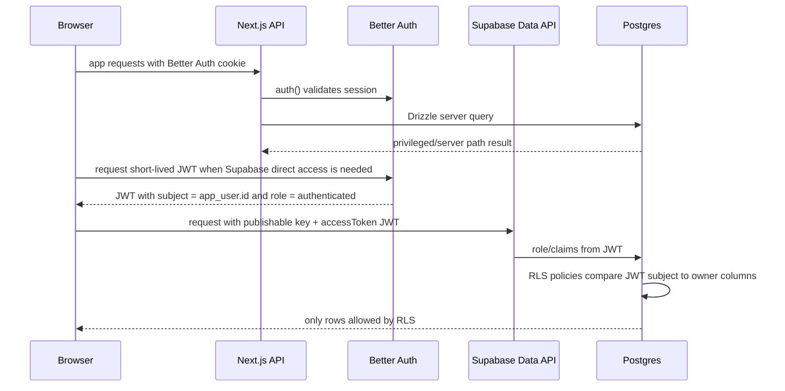

# feat: Define Supabase RLS for Better Auth

## Overview

Supabase Row Level Security를 현재 Drizzle/PostgreSQL 스키마에 적용하되, 인증 원천은 Better Auth로 유지한다. 핵심은 Better Auth 세션을 Supabase가 해석할 수 있는 JWT 신뢰 경계로 연결하고, 각 테이블에 public read, owner write, server-only 접근을 명확히 나누는 것이다.

이 계획은 먼저 스키마별로 필요한 RLS 정책을 정의한다. 구현 시에는 현재 서버 API가 이미 `auth()` / `withAuthRequired`로 Better Auth 세션을 검증한다는 점을 보존하고, Supabase Data API 또는 클라이언트 직접 접근이 필요한 표면만 JWT 기반 RLS를 타도록 단계적으로 열어야 한다.

## Problem Frame

현재 앱은 Next.js API route와 서버 컴포넌트에서 `DATABASE_URL` 기반 Drizzle 클라이언트로 직접 PostgreSQL에 접근한다. Better Auth는 `app_user`, `auth_account`, `auth_session`, `auth_verification` 테이블을 Drizzle adapter로 사용하며, 보호 API는 `src/lib/auth/withAuthRequired.ts`에서 세션을 검증한다.

Supabase RLS를 단순히 켜면 기존 서버 DB 연결이 어떤 PostgreSQL role로 접속하는지에 따라 API가 막히거나, 반대로 privileged role이 RLS를 우회해 기대한 보호 효과가 생기지 않을 수 있다. 따라서 이 작업의 목적은 "앱 서버 권한 검증을 대체"하는 것이 아니라, Supabase exposed API, future Realtime/Storage/Data API 접근, 운영 도구 오사용에 대한 방어층을 추가하는 것이다.

## Requirements Trace

- R1. Better Auth를 인증 원천으로 유지하고 Supabase Auth로 사용자 테이블을 이중화하지 않는다.
- R2. Supabase RLS가 Better Auth 사용자 id를 안정적으로 해석할 수 있는 JWT claim 계약을 정의한다.
- R3. 각 DB 스키마/테이블에 대해 public, authenticated owner, server-only 접근 권한을 구분한다.
- R4. Better Auth 내부 테이블과 결제/크레딧/쿠폰성 데이터는 클라이언트 직접 write를 허용하지 않는다.
- R5. 공개 프로필 페이지는 anon read를 허용하되 편집/삭제는 owner만 가능해야 한다.
- R6. RLS 활성화가 기존 Next.js API, Better Auth adapter, webhook, background job 흐름을 중단하지 않도록 rollout 경계를 둔다.

## Scope Boundaries

- Supabase Auth로 마이그레이션하지 않는다.
- 현재 앱의 서버 API 권한 검증을 제거하지 않는다.
- 모든 서버 쿼리에 RLS를 강제하는 `force row level security` 전환은 이번 범위에서 제외한다.
- Storage bucket policy는 별도 작업으로 둔다. 이 계획은 PostgreSQL table RLS를 대상으로 한다.
- super-admin UI 또는 조직/역할 기반 RBAC는 현재 스키마에 없으므로 새 제품 권한 모델을 만들지 않는다.

## Context & Research

### Relevant Code and Patterns

- `src/auth.ts`: Better Auth 서버 설정, Drizzle adapter schema mapping, `auth()` wrapper.
- `src/lib/auth/withAuthRequired.ts`: 보호 API의 실제 세션 검증과 `getUser`, `getCurrentPlan` lazy query.
- `src/db/schema/core/user.ts`: Better Auth user/account/session/verification 테이블과 결제 customer id, credits snapshot.
- `src/db/schema/core/profile-page.ts`: 공개 프로필 page와 owner-managed child collection.
- `src/db/schema/core/plans.ts`: 공개 가격/quota 성격의 plan catalog.
- `src/db/schema/core/credits.ts`: 사용자별 credit ledger.
- `src/db/schema/extensions/coupons.ts`: 쿠폰 code와 claim 상태.
- `src/lib/profile-page/queries.ts`: public read와 owner editor read가 이미 분리되어 있다.
- `src/lib/profile-page/mutations.ts`: owner page를 먼저 찾고 child row를 조작하는 패턴을 사용한다.
- `drizzle.config.ts`: schema entry가 core schema와 optional extension schema로 구성된다.

### Institutional Learnings

- `docs/solutions/documentation-gaps/data-model-and-migration-map-2026-04-28.md`: DB 변경은 schema, migration, domain mutation, 정상 read path를 함께 봐야 한다.
- `docs/solutions/documentation-gaps/auth-navigation-and-cache-boundaries-2026-04-28.md`: proxy cookie signal은 UX 힌트이고 실제 보안 검증은 `auth()` / `withAuthRequired`가 담당한다.
- `docs/solutions/documentation-gaps/user-onboarding-and-auth-funnel-map-2026-04-28.md`: onboarding은 auth, handle availability, upload, profile page 생성이 연결되어 실패/부분 생성 상태를 주의해야 한다.
- `docs/solutions/documentation-gaps/payments-credits-and-background-jobs-map-2026-04-28.md`: payment/credits는 원장성 데이터이므로 client write를 열기 전에 webhook idempotency와 server ownership을 확인해야 한다.

### External References

- Supabase RLS 문서는 exposed schema table에 RLS를 켜고 policy로 least privilege를 부여하는 모델을 권장한다: https://supabase.com/docs/guides/database/postgres/row-level-security
- Supabase는 third-party/custom JWT를 `Authorization: Bearer <jwt>` 또는 client `accessToken`으로 전달할 수 있고, RLS는 JWT claim을 기반으로 동작한다: https://supabase.com/docs/guides/auth/jwts
- Supabase third-party auth는 비대칭 JWT, `kid`, issuer/JWKS discovery 성격의 신뢰 경계를 요구한다: https://supabase.com/docs/guides/auth/third-party/overview
- Better Auth JWT plugin은 `/token`, `/jwks`, JWT payload customization, issuer/audience/subject customization을 제공한다: https://better-auth.com/docs/plugins/jwt
- Drizzle ORM 현재 설치 버전은 `pgPolicy`, Supabase predefined roles, `enableRLS()` table marker를 제공한다. 최신 문서는 `withRLS()`도 안내하지만 이 repo의 `drizzle-orm@0.38.4`에는 `enableRLS()`가 맞다.

## Key Technical Decisions

- Better Auth remains the identity source: 사용자 생성, 세션, account linking은 계속 Better Auth가 담당하고 Supabase Auth user table을 병행하지 않는다. 이중 auth source는 user id drift와 account lifecycle 불일치를 만든다.
- Use Better Auth JWT as the Supabase RLS token contract: Supabase Data API를 직접 호출해야 하는 클라이언트는 Better Auth JWT plugin에서 받은 short-lived JWT를 Supabase client `accessToken`으로 전달한다.
- Use a text-safe current-user helper instead of assuming `auth.uid()` UUID semantics everywhere: 현재 `app_user.id`는 `text` column이고 기본값은 UUID 문자열이다. 정책은 `(auth.jwt() ->> 'sub')` 또는 별도 helper의 text 반환값을 `userId`와 비교해 Better Auth id type 변경에도 덜 취약하게 둔다.
- Do not expose Better Auth internal tables through Supabase policies: `auth_account`, `auth_session`, `auth_verification`, future `jwks`는 RLS enabled + no `anon`/`authenticated` policy로 둔다. Better Auth adapter와 서버만 privileged connection으로 접근한다.
- Public profile content is readable by anon; ownership writes require the JWT subject: `profile_page`와 child tables는 link-in-bio public surface이므로 read는 공개하되 insert/update/delete는 owner만 허용한다.
- Server-only tables stay server-only unless a user-facing read exists: `credit_transactions`는 현재 server-only로 닫고, 나중에 ledger UI나 직접 Supabase read 요구가 생길 때 owner select를 별도 설계한다. `coupon`은 code enumeration 위험 때문에 client read/write를 열지 않고 redemption API에서 처리한다.
- Default closed beats optional exposure for sensitive base tables: `app_user`와 `credit_transactions`는 현재 클라이언트 직접 Supabase read 요구가 없으므로 initial policy는 exposed roles에 닫아 둔다. 나중에 필요하면 safe view 또는 narrow API를 먼저 설계한 뒤 owner read를 연다.
- Keep `DB_MODULES` schema inclusion control: `drizzle.config.ts`의 module filter는 런타임 데이터 접근 제한이 아니라 어떤 optional schema 파일을 migration 대상에 포함할지 정하는 빌드/운영 경계다. RLS가 row access를 담당하더라도 이 설정은 제거하지 않는다.
- Keep route and API authorization checks as the product control plane: RLS는 DB row 접근 방어층이고, `/:handle/app` 같은 인앱 route guard, canonical handle redirect, onboarding redirect, API unauthorized response contract는 앱 레벨 책임이다. RLS를 추가해도 `auth()`, `withAuthRequired`, owner lookup 기반 redirect 코드를 제거하지 않는다.
- Do not force backend RLS in the first rollout: 현재 `db`는 per-request JWT claim을 주입하지 않는다. 즉시 forced RLS로 전환하면 서버 API와 Better Auth adapter가 깨질 수 있으므로 첫 단계는 exposed roles 정책과 privileged backend compatibility를 분리한다.

## Schema-Level RLS Definition

| Schema file | Table | RLS mode | `anon` policy | `authenticated` policy | Server/privileged behavior |
|---|---|---:|---|---|---|
| `src/db/schema/core/user.ts` | `app_user` | enable | none | none initially; future own read only through safe view or explicit narrow policy | Better Auth hooks, webhooks, plan/credits updates remain server-only |
| `src/db/schema/core/user.ts` | `auth_account` | enable | none | none | Better Auth adapter only |
| `src/db/schema/core/user.ts` | `auth_session` | enable | none | none | Better Auth adapter only |
| `src/db/schema/core/user.ts` | `auth_verification` | enable | none | none | Better Auth adapter only |
| `src/db/schema/core/user.ts` | `jwks` if JWT plugin adds it | enable | none | none | Better Auth JWT plugin only; public keys exposed through `/api/auth/jwks`, not table reads |
| `src/db/schema/core/profile-page.ts` | `profile_page` | enable | `select true` for public profile discovery | `select true`; `insert/update/delete` only where JWT subject equals `userId` | server routes keep existing checks |
| `src/db/schema/core/profile-page.ts` | `profile_social_link` | enable | `select` when parent page exists | `select` public; `insert/update/delete` only when parent page owner equals JWT subject | owner mutation routes remain canonical |
| `src/db/schema/core/profile-page.ts` | `profile_link_item` | enable | `select` when parent page exists | `select` public; `insert/update/delete` only when parent page owner equals JWT subject | owner mutation routes remain canonical |
| `src/db/schema/core/profile-page.ts` | `profile_text_box_item` | enable | `select` when parent page exists | `select` public; `insert/update/delete` only when parent page owner equals JWT subject | owner mutation routes remain canonical |
| `src/db/schema/core/plans.ts` | `plans` | enable | `select true` | `select true` | writes server/admin only |
| `src/db/schema/core/credits.ts` | `credit_transactions` | enable | none | none initially; future own `select` only when ledger UI/API needs it | ledger reads/writes only through server, webhook, Inngest |
| `src/db/schema/extensions/coupons.ts` | `coupon` | enable | none | none initially | redemption and cleanup through server-only APIs |

## Open Questions

### Resolved During Planning

- Should Supabase Auth become the auth source? No. The repo is built around Better Auth tables and hooks, and the user explicitly called out Better Auth compatibility.
- Should public profile rows be `anon` readable? Yes. `getPublicProfilePage`, sitemap generation, OG/Twitter image routes, and `/{handle}` are public product surfaces.
- Should coupon rows be directly readable by authenticated users? No. Coupon codes are bearer-like values and broad select policies would make enumeration easier.
- Should backend queries immediately run as the end user under RLS? No for the first rollout. Existing Drizzle access does not inject per-request JWT claims, so this is a later hardening phase.
- Should `DB_MODULES` be removed after RLS is added? No. `DB_MODULES` controls migration schema inclusion, not row authorization. Removing it would collapse optional extension boundaries and currently risks referencing extension schema files that do not exist in this repo.
- Can RLS replace `/:handle/app` and API-level owner/access checks? No for this repo's initial RLS rollout. `src/app/(in-app)/[handle]/layout.tsx`, `src/app/(in-app)/[handle]/app/layout.tsx`, `src/app/(in-app)/[handle]/analytics/page.tsx`, and `src/lib/auth/withAuthRequired.ts` do more than filter rows: they validate Better Auth sessions, choose redirect destinations, normalize stale handles, hydrate scoped app data, and preserve API error contracts.

### Deferred to Implementation

- Exact Supabase project JWT configuration: The implementer must verify whether the target Supabase project will trust Better Auth's JWKS directly, an imported asymmetric signing key, or a legacy-compatible bridge.
- Exact generated Better Auth JWT claims: The implementer must confirm token payload contains `sub`, `role: authenticated`, appropriate `aud`, and expected issuer before opening any Data API client path.
- Whether `app_user` or `credit_transactions` own select is needed later: Initial rollout keeps both closed to exposed roles. Re-open only after a user-facing direct Supabase read path exists and safe column exposure is reviewed.
- Whether Drizzle schema policy generation is sufficient for all policies: If Drizzle cannot express a policy or helper cleanly at the installed version, add a migration SQL file and keep schema definitions documented.
- Whether Supabase can trust Better Auth directly: This is a blocking prerequisite for browser Data API access, not a runtime surprise. If the target Supabase project cannot trust Better Auth's JWT issuer/JWKS or an imported signing key, ship RLS for public/server boundaries only and keep authenticated data behind Next.js APIs.
- Whether obsolete extension entries should be pruned from `DB_MODULES`: This is separate cleanup. The RLS implementation should not remove the module gate; a later repo hygiene task can decide whether README/env examples should stop listing missing `contact`, `paypal`, or `waitlist` modules.
- Whether a future backend can rely more heavily on RLS: Only after server DB access is changed to execute under per-request user claims, or after all relevant reads/writes move to Supabase Data API with Better Auth JWT. Even then, route-level auth/redirect UX should stay; only duplicated SQL owner predicates could be reconsidered case by case.

## High-Level Technical Design

> *This illustrates the intended approach and is directional guidance for review, not implementation specification. The implementing agent should treat it as context, not code to reproduce.*

## Implementation Units

- [x] **Unit 1: Define the Better Auth to Supabase JWT contract**

**Goal:** Add the auth-side contract needed for Supabase RLS to identify a Better Auth user without introducing Supabase Auth as a second user source.

**Requirements:** R1, R2, R6

**Dependencies:** None

**Files:**
- Modify: `src/auth.ts`
- Modify: `src/lib/auth-client.ts`
- Modify: `src/db/schema/core/user.ts`
- Test: `src/lib/auth/better-auth-supabase-jwt.test.ts`

**Approach:**
- Before adding client Data API usage, verify the target Supabase project can trust the Better Auth JWT path. Acceptable outcomes are direct issuer/JWKS trust, imported asymmetric signing key, or an explicit decision to keep authenticated access behind server APIs.
- Add Better Auth JWT plugin only if the project will call Supabase APIs directly from browser/client contexts.
- Configure JWT subject as `app_user.id`, include a Supabase-compatible role claim for authenticated requests, and keep token lifetime short.
- If the JWT plugin introduces a `jwks` table, add it to Drizzle schema with server-only RLS.
- Keep session cookie auth as the normal app auth path; JWT is for Supabase-compatible downstream calls, not a replacement for Better Auth sessions.

**Execution note:** Start with a token-shape test around the payload builder or extracted auth JWT configuration before exposing client usage.

**Patterns to follow:**
- `src/auth.ts` centralizes Better Auth plugin and database adapter configuration.
- `src/lib/auth-client.ts` centralizes browser auth client setup.

**Test scenarios:**
- Happy path: signed-in Better Auth user requests a token -> token payload resolves to the same `app_user.id` as `sub`.
- Happy path: token includes the claim Supabase will use for `authenticated` role selection.
- Edge case: user without a valid Better Auth session cannot obtain a Supabase access token.
- Error path: JWT/JWKS endpoint misconfiguration fails closed and does not create a token with missing subject.
- Integration: generated JWT can be verified against the configured JWKS or selected Supabase trust mechanism in a local verification helper.
- Integration: if Supabase trust cannot be configured in the target project, browser Data API access is not introduced and existing server API access still succeeds.

**Verification:**
- A reviewer can inspect the token contract and know exactly which claim RLS policies read.
- Existing Better Auth sign-in, sign-up, and session behavior remains unchanged.

- [x] **Unit 2: Add shared RLS helpers and Drizzle policy primitives**

**Goal:** Establish reusable policy expressions for current Better Auth user id and parent profile ownership so table policies stay consistent.

**Requirements:** R2, R3, R6

**Dependencies:** Unit 1

**Files:**
- Create: `src/db/schema/rls.ts`
- Modify: `src/db/schema/core/user.ts`
- Modify: `src/db/schema/core/profile-page.ts`
- Modify: `src/db/schema/core/plans.ts`
- Modify: `src/db/schema/core/credits.ts`
- Modify: `src/db/schema/extensions/coupons.ts`
- Test: `src/db/schema/rls.test.ts`

**Approach:**
- Use Drizzle `pgPolicy`, Supabase predefined roles, and the installed version's `enableRLS()` marker.
- Define one text-safe current-user expression based on JWT `sub` instead of scattering raw `auth.uid()` comparisons.
- Define ownership expressions that compare `profile_page.userId` or child-row parent ownership to the current user expression.
- Account for SQL grants separately from RLS policies. Policies decide row visibility, but exposed roles still need only the minimum table/view privileges required for intended reads or writes.
- Keep helpers declarative and schema-local; do not add runtime app logic here.

**Execution note:** Characterize generated migration SQL before applying it to a shared database.

**Patterns to follow:**
- Existing schema files keep indexes and table definitions close to the table declaration.
- `docs/solutions/documentation-gaps/data-model-and-migration-map-2026-04-28.md` recommends checking schema, migration, and read paths together.

**Test scenarios:**
- Happy path: helper expression renders a text user id comparison against JWT subject.
- Edge case: missing JWT subject resolves to no owner match.
- Error path: malformed JWT subject does not grant access by accidental truthy comparison.
- Integration: generated Drizzle migration includes RLS enabled for every table in the matrix.
- Integration: exposed roles have no broader grants than the policy matrix requires.

**Verification:**
- All policy definitions use the same current-user helper or a deliberately documented exception.
- Drizzle migration output is reviewable and does not silently change unrelated schema.

- [x] **Unit 3: Protect Better Auth internal and user account tables**

**Goal:** Ensure auth internals are not queryable through Supabase exposed roles while preserving Better Auth adapter access.

**Requirements:** R1, R3, R4, R6

**Dependencies:** Units 1 and 2

**Files:**
- Modify: `src/db/schema/core/user.ts`
- Modify: `drizzle.config.ts` if the JWT plugin adds a new table file
- Test: `src/db/rls/auth-tables.integration.test.ts`

**Approach:**
- Enable RLS on `app_user`, `auth_account`, `auth_session`, `auth_verification`, and future `jwks`.
- Add no `anon` or `authenticated` policies for `auth_account`, `auth_session`, `auth_verification`, and `jwks`.
- Keep `app_user` closed to exposed roles in the initial rollout. If a future client needs account data, prefer `/api/me` or a safe projected view over base table access because the base row contains payment provider IDs and credit snapshot data.
- Do not allow client-side `insert`, `update`, or `delete` on `app_user`; profile metadata changes should continue through API routes.

**Patterns to follow:**
- `src/auth.ts` Better Auth adapter owns auth table reads/writes.
- `src/lib/auth/withAuthRequired.ts` projects a controlled `MeResponse` rather than exposing raw user table columns.

**Test scenarios:**
- Happy path: Better Auth server adapter can still create a session and read it through the server DB path.
- Edge case: authenticated Supabase Data API request cannot select any `app_user` row in the initial rollout.
- Error path: anon Supabase Data API request receives no auth table rows.
- Integration: sign-up still triggers `onUserCreate` and assigns default plan when RLS is enabled.

**Verification:**
- Better Auth auth flows still work.
- Supabase exposed roles cannot enumerate sessions, accounts, verification tokens, JWKS private keys, or payment identifiers.

- [x] **Unit 4: Add public read and owner write policies for profile schema**

**Goal:** Allow public profile rendering while limiting profile editing and child collection writes to the owner identified by Better Auth JWT subject.

**Requirements:** R3, R5, R6

**Dependencies:** Unit 2

**Files:**
- Modify: `src/db/schema/core/profile-page.ts`
- Test: `src/db/rls/profile-page-policies.integration.test.ts`
- Test: `src/lib/profile-page/profile-page-sync-schema.test.ts`

**Approach:**
- `profile_page`: `anon` and `authenticated` can select public rows; authenticated insert/update/delete must satisfy `current_user_id = userId`.
- `profile_social_link`, `profile_link_item`, `profile_text_box_item`: public select is allowed through parent profile existence; authenticated writes require parent page ownership.
- Audit column exposure before relying on base-table public select through Supabase Data API. If future profile columns become private, add public views and grant Data API reads to those views instead of the base tables.
- Preserve existing server-side domain checks in `src/lib/profile-page/mutations.ts`.
- Avoid adding "private profile" semantics because the current product surface is public profile pages.

**Patterns to follow:**
- `src/lib/profile-page/queries.ts` already separates public read from owner editor read.
- `src/lib/profile-page/mutations.ts` uses `getOwnedPageOrThrow(userId)` before child mutations.

**Test scenarios:**
- Happy path: anon request can select a public profile page and its social/link/text child rows by handle.
- Happy path: authenticated owner can insert, update, reorder, and delete child rows for their own page.
- Edge case: authenticated user with no profile page cannot insert child rows.
- Edge case: owner can change their handle only through a policy-compatible update on their own page.
- Error path: authenticated user cannot update or delete another user's page or child rows.
- Integration: onboarding creates page + initial social links without violating RLS in the server path.

**Verification:**
- Public `/{handle}` data remains readable.
- Editor mutations remain owner-scoped and cross-user writes are denied by both app logic and RLS.

- [x] **Unit 5: Add catalog, ledger, and coupon policies**

**Goal:** Classify business data into public catalog, owner-readable ledger, and server-only coupon surfaces.

**Requirements:** R3, R4, R6

**Dependencies:** Unit 2

**Files:**
- Modify: `src/db/schema/core/plans.ts`
- Modify: `src/db/schema/core/credits.ts`
- Modify: `src/db/schema/extensions/coupons.ts`
- Test: `src/db/rls/business-data-policies.integration.test.ts`

**Approach:**
- `plans`: allow `anon` and `authenticated` select; deny exposed-role writes.
- `credit_transactions`: keep exposed-role select/write closed in the initial rollout because credits are currently disabled and the ledger includes payment ids and metadata. Add owner select later only if a ledger UI or direct Supabase read path exists.
- `coupon`: enable RLS with no exposed-role policies initially. Coupon validation and claiming should happen through server API or a later controlled RPC.
- Keep `app_user.credits` snapshot write server-only to avoid client balance tampering.

**Patterns to follow:**
- `docs/solutions/documentation-gaps/payments-credits-and-background-jobs-map-2026-04-28.md` distinguishes ledger rows from current balance snapshot.
- `src/lib/credits/recalculate.ts` owns credit transaction writes and snapshot recalculation.
- `src/auth.ts` delete hook nulls `coupon.userId` server-side.

**Test scenarios:**
- Happy path: anon request can read plan catalog rows needed for pricing display.
- Happy path: authenticated Supabase Data API request cannot read credit transaction rows until a user-facing ledger read path is explicitly introduced.
- Edge case: user with no credit feature enabled receives no direct ledger exposure rather than an empty-but-enabled API surface.
- Error path: authenticated user cannot insert a credit transaction or mutate their credit snapshot through Supabase exposed roles.
- Error path: anon or authenticated broad select on `coupon` returns no rows.
- Integration: webhook/background job server path can still update plan/customer/credit/coupon state.

**Verification:**
- Pricing/catalog reads remain possible.
- Money-like and bearer-code data is not client-writable or enumerable.

- [x] **Unit 6: Add Supabase access boundary and rollout verification**

**Goal:** Make the RLS rollout explicit so implementers do not accidentally expose service credentials or break backend jobs.

**Requirements:** R2, R3, R4, R5, R6

**Dependencies:** Units 1-5

**Files:**
- Modify: `package.json`
- Modify: `bun.lock`
- Modify: `src/env.ts`
- Create: `src/lib/supabase/client.ts`
- Create: `src/db/rls/rls-rollout.test.ts`
- Modify: `README.md`
- Modify: `ONBOARDING.md`

**Approach:**
- If direct browser Supabase access is required, add `@supabase/supabase-js` with `bun` and define only public Supabase URL/publishable key env vars for the client.
- If a browser Supabase client is introduced, it must use a publishable key and Better Auth JWT access token callback, never service role or secret keys.
- Keep server Drizzle `DATABASE_URL` as the canonical app data path until a separate backend-RLS hardening plan is written.
- Keep `auth()` and `withAuthRequired` checks on server pages and API routes. RLS should deny accidental or malicious row access, but app code should still decide whether a request becomes `/sign-in`, `/create`, canonical `/:ownedHandle/app`, JSON 401, or a normal render.
- Document which tables are intentionally public-read and which are server-only.
- Add rollout checks that verify RLS is enabled and exposed-role policies match the schema matrix.

**Patterns to follow:**
- `src/env.ts` centralizes public vs server-only environment variables.
- Supabase docs require service/secret keys to remain backend-only because they bypass RLS.

**Test scenarios:**
- Happy path: browser Supabase client uses publishable key plus Better Auth JWT access token and can read allowed public profile data.
- Edge case: missing JWT keeps the client in anon mode and only public policies apply.
- Error path: service role or secret key is not present in any client-exposed environment variable.
- Error path: if `@supabase/supabase-js` or publishable env vars are absent, no browser Supabase client is instantiated.
- Integration: RLS smoke test covers anon, owner, non-owner, and server/privileged access for representative tables.
- Integration: visiting `/:otherHandle/app` while signed in redirects to the signed-in user's canonical app route instead of relying on an empty RLS result.
- Integration: unauthenticated API calls still return the existing JSON 401 contract from `withAuthRequired`.

**Verification:**
- RLS can be enabled without exposing privileged keys.
- The plan's policy matrix is represented in automated checks or a deterministic smoke-test script.

## Implementation Result

Completed on 2026-04-28.

- Added Better Auth JWT plugin configuration with `aud: authenticated`, short token lifetime, `sub = app_user.id`, and `role: authenticated`.
- Added Better Auth `jwks` table mapping for the JWT plugin and kept it RLS-enabled with no exposed-role policies.
- Added shared RLS helpers in `src/db/schema/rls.ts` based on `auth.jwt() ->> 'sub'`.
- Enabled RLS for core user/auth/profile/plan/credit tables and optional coupon schema.
- Added public read and owner write policies for profile tables, public read for `plans`, and no exposed-role policies for auth internals, `app_user`, `credit_transactions`, `jwks`, and `coupon`.
- Generated `drizzle/0010_early_masked_marvel.sql` and added explicit `REVOKE`/`GRANT` statements so exposed roles receive only the privileges represented by the policy matrix.
- Documented the Better Auth + Supabase RLS boundary in `README.md` and `ONBOARDING.md`.
- Did not add `@supabase/supabase-js` or a browser Supabase client in this rollout because direct browser Data API access is not required yet and the target Supabase JWT trust configuration remains an operational prerequisite.

Verification run:

- `bun test src/lib/auth/supabase-jwt.test.ts src/db/schema/rls.test.ts`
- `bun x biome check src/auth.ts src/lib/auth-client.ts src/lib/auth/supabase-jwt.ts src/lib/auth/supabase-jwt.test.ts src/db/schema/rls.ts src/db/schema/rls.test.ts src/db/schema/core/user.ts src/db/schema/core/profile-page.ts src/db/schema/core/plans.ts src/db/schema/core/credits.ts src/db/schema/extensions/coupons.ts`

Known existing repo checks:

- `bun run lint` still fails on pre-existing unrelated files such as `src/app/global-error.tsx`, webhook route typing, and animate-ui formatting.
- `bun x tsc --noEmit --pretty false` still fails on pre-existing `.next/types/validator.ts` stale route references and existing test matcher type gaps. The new RLS/JWT test files no longer appear in the TypeScript error output.

## System-Wide Impact

- **Interaction graph:** Better Auth session cookie remains the app auth path. Better Auth JWT is added only for Supabase-compatible downstream calls. Supabase Data API maps JWT claims to PostgreSQL roles/claims, then RLS filters rows.
- **Error propagation:** Missing/invalid JWT should behave as anon access, not partial authenticated access. Server API auth failures should continue returning existing unauthorized responses.
- **State lifecycle risks:** Onboarding and profile sync combine parent and child writes; RLS child policies must check parent ownership so partial inserts cannot attach rows to another user's page.
- **API surface parity:** Existing Next.js API routes remain canonical for mutations. Any future Supabase direct mutation must meet the same owner checks as route handlers.
- **Integration coverage:** Unit tests alone are insufficient. At least one integration smoke suite must exercise anon, owner, non-owner, and server paths against a PostgreSQL/Supabase-compatible database.
- **Unchanged invariants:** Better Auth tables stay the source of user/session truth; public profile URL `/:handle` remains publicly readable; payment/credit/coupon mutations stay server-owned.

## Risks & Dependencies

| Risk | Mitigation |
|------|------------|
| Supabase cannot directly trust the selected Better Auth JWT shape in the target project | Verify JWT issuer/audience/JWKS support before exposing browser Supabase access; if unsupported, keep RLS prepared but route all access through server APIs until a bridge is designed |
| RLS blocks existing server flows | Do not force RLS on backend role in the first rollout; run auth, onboarding, webhook, and Inngest smoke checks before production migration |
| `auth.uid()` UUID assumptions mismatch text user ids | Use a text-safe helper around JWT `sub`; add tests for missing/malformed subject |
| Public profile policies expose more columns than intended | Audit base-table columns before granting Data API read; use public views if `userId` or future columns become sensitive |
| RLS policies are correct but SQL grants are too broad | Include grants/revokes in migration review and smoke tests so exposed roles only have privileges matching the policy matrix |
| Coupon code enumeration through Data API | Keep `coupon` closed to exposed roles and redeem through server API/RPC only |
| Drizzle RLS API changes across versions | Use installed `drizzle-orm@0.38.4` capabilities for this implementation; defer `withRLS()` migration unless dependencies are upgraded intentionally |
| Service role key leaks to client | Add env boundary review and tests that no service/secret key is referenced by client code |

## Documentation / Operational Notes

- Update `README.md` and `ONBOARDING.md` with the Better Auth + Supabase RLS trust model.
- Document that `DATABASE_URL` is a backend-only credential and browser Supabase clients must use publishable key plus Better Auth JWT.
- Record the schema-level RLS matrix near DB schema documentation so future table additions classify access before migration.
- Before production rollout, capture current Supabase project auth/JWT configuration and key rotation expectations.

## Sources & References

- Related code: `src/auth.ts`
- Related code: `src/lib/auth/withAuthRequired.ts`
- Related code: `src/db/schema/core/user.ts`
- Related code: `src/db/schema/core/profile-page.ts`
- Related code: `src/db/schema/core/plans.ts`
- Related code: `src/db/schema/core/credits.ts`
- Related code: `src/db/schema/extensions/coupons.ts`
- Related learning: `docs/solutions/documentation-gaps/data-model-and-migration-map-2026-04-28.md`
- Related learning: `docs/solutions/documentation-gaps/auth-navigation-and-cache-boundaries-2026-04-28.md`
- Supabase RLS docs: https://supabase.com/docs/guides/database/postgres/row-level-security
- Supabase JWT docs: https://supabase.com/docs/guides/auth/jwts
- Supabase third-party auth docs: https://supabase.com/docs/guides/auth/third-party/overview
- Supabase data security docs: https://supabase.com/docs/guides/database/secure-data
- Better Auth JWT plugin docs: https://better-auth.com/docs/plugins/jwt
- Drizzle ORM RLS docs: https://orm.drizzle.team/docs/rls
